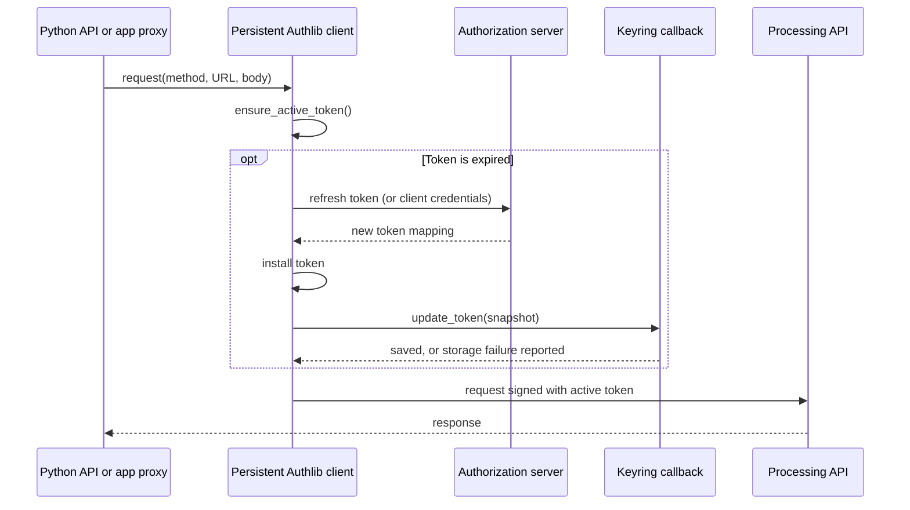

# Authlib integration for Cuiman: proposed design

Date: 2026-09-09. Status: proposal for review; no implementation authorized by this document.

**Recommendation:** make a persistent Authlib HTTPX2 OAuth client the object that
holds the live OAuth token and sends authenticated API requests. Replace Cuiman's
existing OAuth session manager with a small amount of application policy attached
to that client. Keep configuration, local interaction, and secret storage as
application responsibilities.

This is based on the current checkout at `a93323c1`, the authentication source and
tests, and Authlib's versioned **1.8.0** source. The checkout has advanced since
the handover. Authlib is not installed in the current default environment and is
not a declared project dependency. Research findings and primary-source links are
in [AUTHLIB_RESEARCH.md](AUTHLIB_RESEARCH.md). The original proposal was based on
source analysis; subsequent executable evidence is recorded below.

The first isolated executable proof has since been completed against Authlib
1.8.0 / HTTPX2 2.5.0: [results and reproduction](tools/authlib_proof/README.md).
Ten sync/async scenarios validate the sequential lifecycle and persistence policy.
Direct Authlib clients and callback wiring were sufficient for that scope;
subclasses should be introduced only when a remaining policy actually needs them.
Production integration, concurrency, cancellation, and proxy behavior remain
unverified. The next production step still requires review of these results.

## 1. Use the HTTP clients

Use `authlib.integrations.httpx_client.OAuth2Client` for `Client` and
`AsyncOAuth2Client` for `AsyncClient`. Despite the import path, version 1.8.0 uses
HTTPX2 when available. These clients combine HTTP connection management and OAuth
handling, and are intended to send protected resource requests themselves.
[HTTP client documentation](https://docs.authlib.org/en/stable/oauth2/client/http/httpx.html)

Do not use the Starlette/FastAPI OAuth registry for the launched-app proxy. That
integration fits a web application whose login redirect and authorization
callback belong to browser requests and web sessions. Cuiman's browser instead
receives an opaque launch capability and uses credentials held by its Python
owner. Preserve that boundary. The web integration would become relevant if
Cuiman later offered independent browser-user login.
[Starlette integration](https://docs.authlib.org/en/stable/oauth2/client/web/starlette.html)

Use ordinary HTTPX2 clients for Basic, API keys, static access tokens, proprietary
login, and unauthenticated access. Selecting among the existing authentication
types needs a straightforward factory, not a provider registry.

## 2. Ownership before and after

| Responsibility | Current owner | Proposed owner |
| --- | --- | --- |
| Live OAuth access/refresh token | Mutable Pydantic auth configuration | Persistent Authlib client's `token` |
| Expiry normalization and decision | Not implemented | Authlib token model and `ensure_active_token` |
| OAuth form encoding, token endpoint authentication, response/error parsing | Cuiman OAuth/OIDC helpers | Authlib |
| Refresh and client-credentials reacquisition | Cuiman session dispatch and helper requests | Authlib, with grant metadata configured once |
| Protected request authentication | Copied header dictionaries | Authlib request signing |
| Explicit login, prompts, browser permission | Cuiman session/interactive helpers | Cuiman client login and interactive helpers |
| Password fallback and one resource-401 replay | Session plus transport/proxy callbacks | One small policy implementation at the OAuth client |
| Keyring profile and durable snapshot | Config hook and secret store | Storage callback bound when constructing the OAuth client |
| API model conversion and API error mapping | `Httpx2Transport` | `Httpx2Transport`, unchanged in purpose |
| Browser authorization to use the proxy | Launch code and HttpOnly cookie | Existing launch code and cookie |
| Proxy upstream credentials | Per-browser header snapshots | Reference to the Python owner's authenticated requester |

Implement the OAuth policy as two thin subclasses of Authlib's sync/async HTTP
clients, with shared pure policy helpers where useful. Put these in the existing
authentication area and remove the displaced OAuth responsibilities from
`session.py`. Avoid a second wrapper holding its own token, expiry clock, or
refresh state.

The subclasses may add explicit preparation/login, the resource-401 policy,
coordination of application-triggered transitions, and persistence integration.
They must delegate protocol operations and expiry decisions to Authlib. They must
not reproduce its `_fetch_token`, `_refresh_token`, or token parser implementations.
If preserving a contract requires doing that, return to review.

`Httpx2Transport` receives the persistent HTTP client instead of OAuth headers
and refresher callbacks. It constructs API requests and processes responses.
Client login must create this runtime even if no API method has been called;
client close must therefore close it even when transport creation never occurred.

### Generated clients and handwritten lifecycle code

`Client` and `AsyncClient` are generated by
[`tools/gen_client.py`](tools/gen_client.py). Change their generator whenever
their generated structure must change, then regenerate both files with
`pixi run gen-client`. Do not hand-edit generated clients as the source of a fix.

Keep login, lazy authenticated-client creation, the proposed token snapshot
property, and lifecycle behavior in the handwritten `ClientMixin` and
`AsyncClientMixin`. Keep app borrowing in `ClientAppMixin` and the app service.
The generated API methods already call the mixins' `_get_transport()` methods;
that is the existing seam for routing requests through Authlib without changing
every generated endpoint.

The generator currently emits both constructors and `close()` methods. In
particular, generated `close()` only closes `_transport`, and overrides any
same-named mixin method. Recommend moving `close()` ownership to the appropriate
mixin and removing its generation, so the handwritten lifecycle closes both the
authenticated runtime and any transport without double-closing shared resources.
If explicit per-instance runtime initialization is needed, make the constructor
template invoke a small mixin initialization method. Never put mutable runtime
state on the mixin class or OAuth lifecycle logic in the generator template.

For a production step touching these seams, change the generator and handwritten
code together, regenerate both clients, and review the generated diff. Check
regeneration consistency allowing for generated timestamps, and exercise cleanup
through the actual generated client classes, including login without an API
request and injected transports. No generator execution or production change is
part of this design step.

## 3. One token representation, with explicit compatibility boundaries

The authoritative live value is Authlib's token mapping, including access token,
refresh token when applicable, token type, scope, and absolute expiry. Pass it
through the OAuth path without converting it to `TokenResult` and back.

Configuration remains input and serialization data. Existing `access_token` and
`refresh_token` inputs remain usable to bootstrap OAuth sessions; `auth_type=token`
continues to mean an externally supplied static token with no automatic renewal.
Expose a read-only snapshot of the current OAuth mapping on the client, proposed
as `client.token`. Reading a snapshot must not initiate login or refresh.

**Proposed compatibility change:** OAuth token fields in `client.config.auth`
become bootstrap values, rather than a live token interface. OAuth header/refresher
methods on configuration should be deprecated. Do not continually reconcile a
mutable configuration token with the Authlib token. Existing configuration-driven
code must be given a documented migration to the client runtime before removal.

Persist a complete OAuth snapshot, including **absolute `expires_at`**, at a
storage boundary. Keep keyring identity based on canonical configuration path and
API URL, and reuse the existing chunk storage. A concrete compatible storage
approach is an `oauth_token` JSON string inside the existing string-valued secrets
record, alongside applicable username/password/client-secret values. The loader
accepts old access/refresh-only records and normalizes them once. A secret-only
bootstrap mapping can carry this resolved value into the client factory; no live
runtime objects belong in Pydantic models.

Do not recalculate a fresh expiry from a saved `expires_in` at every startup. Old
records without expiry remain usable and rely on the one-401 recovery policy.
Explicit Python/environment token overrides must discard incompatible stored
expiry and refresh metadata; preserve current runtime-only credential precedence.
Public config files and representations must continue to omit credentials.

Authlib supplies expiry normalization; these are storage and compatibility
decisions around it.
[Authlib token model](https://github.com/authlib/authlib/blob/v1.8.0/authlib/oauth2/rfc6749/wrappers.py)

## 4. Ordinary request and refresh

Initial acquisition is explicit Cuiman preparation: reuse a usable token, use an
available refresh token, or call `fetch_token` with the configured grant. Missing
credentials produce `LoginRequiredError` unless the caller explicitly permitted
interaction. Authlib resource requests do not fetch an initial token from nothing.

For forced login, bypass reuse and call the selected fresh grant on the same
runtime. A fresh fetch replaces the token response as a whole, so it must not
inherit the old refresh token. Do not erase a working token before the network
operation merely to force acquisition. Failed acquisition can retain it; a
successful acquisition followed by failed persistence follows the policy below.

Known expiry uses Authlib automatically. A resource 401 retains Cuiman's maximum
one renewal/replay policy. If another request already replaced the token used by
the rejected request, replay once using the current token; otherwise renew or
reacquire through Authlib. Track the token actually signed on that request, not
a snapshot taken before waiting for a request slot. Token endpoint errors must
never enter this resource-response replay path. Do not replay non-rewindable
request bodies; current JSON API requests and buffered proxy bodies are replayable.

Keep recovery from an HTTP 400 refresh response with OAuth `invalid_grant` to one
fresh password grant when credentials are available. Preserve the HTTP-status
distinction at the token-response boundary: an `invalid_grant` body on a 503 must
not trigger recovery. Also preserve reacquisition when a password grant has no refresh
token. OIDC without a usable refresh token requires explicit login. Other OAuth
errors propagate without a password fallback, interaction, or retry loop.

Use Authlib's `request`/`stream` entry points; inherited low-level `send` is not
an equivalent expiry-aware entry point.

These application policies are not provided wholesale by Authlib. Its source
does supply request-time expiry/refresh and typed OAuth errors.
[HTTP integration source](https://github.com/authlib/authlib/blob/v1.8.0/authlib/integrations/httpx_client/oauth2_client.py)

## 5. Persistence supports recovery across runs

The user clarified that preserving Cuiman's existing save-before-publication
guarantee is not a requirement. Design persistence around Authlib's lifecycle;
do not add transaction machinery to retain that historical behavior.

**Recommend Authlib's memory-first ordering.** Its token parser installs the
token before the refresh update callback. Explicit `fetch_token` does not call
that callback, so Cuiman calls the same save operation after initial/forced
acquisition. An async client needs an async callback: the inspected source awaits
it, despite the documentation's broader claim about synchronous callbacks.
[Core source](https://github.com/authlib/authlib/blob/v1.8.0/authlib/oauth2/client.py),
[async update ordering](https://github.com/authlib/authlib/blob/v1.8.0/authlib/integrations/httpx_client/oauth2_client.py)

The following failure policy is recommended for review; the clarification does
not by itself settle every persistence behavior:

- A provider success makes the new token authoritative in memory.
- During ordinary API use, the persistence callback catches an expected storage
  failure, reports a credential-storage warning, and returns normally. Authlib
  can send/replay the request using the new token. Report this through Python's
  warning machinery, including for server-side proxy use; do not expose secrets
  in browser responses. Unexpected programming errors still propagate.
- Python client login prepares live authentication and follows the same policy
  when optional persistence is configured. In contrast, `cuiman login` explicitly
  promises saved credentials: it must report a failed save as a command failure,
  without claiming authentication itself failed or rolling back the live token.
- The warning explains that credentials are active but saving could not be
  confirmed, so restarting may require login. API request success and durable
  credential storage are distinct outcomes.
- Attempt saving on each subsequent token update. Explicit Python `login()` can
  retry saving an existing token without another provider exchange. Start without
  a background retry queue, duplicate token state, or a new persistence state
  machine. A process ending before a successful save can lose its latest token.

Cancellation before a response is received can leave the provider changed but
the client unaware. After token installation, cancellation must not restore the
previous refresh token. For an asynchronous save, keep ownership of the save
operation until it completes, even if its caller is cancelled; test cancellation
during the worker-backed keyring operation before choosing the exact shielding
implementation. Browser-wait cancellation still stops the temporary callback
server. Cancellation cannot promise rollback of a remote token rotation.

The existing store publishes a new chunk manifest before removing old chunks;
cleanup errors can therefore occur after the new record is already committed.
An exception alone does not prove that the durable record stayed unchanged.
[Current storage implementation](cuiman/src/cuiman/api/auth/secret_store.py)

This replaces the earlier proposal to abort an ordinary API request on storage
failure. Keeping a working authenticated session usable is the default; durable
storage is required when the user explicitly requests it. Update the historical
failure tests to exercise the reviewed policy when implementation is approved,
rather than treating those tests as an architectural constraint.

## 6. Lifetimes, concurrency, and the launched app

One Python client owns one persistent OAuth client. Sync and async clients are
separate ownership domains, not two clients kept synchronized through a mutable
configuration. Do not add global registries or keyring-based locking between
independent clients/processes. Simultaneously reusing the same rotating refresh
token in independently created clients remains outside the guarantee.

Authlib's async lock covers automatic expiry checks, not arbitrary explicit
fetch/refresh or cross-client work; sync has no equivalent renewal lock.
Consequently, use **one application transition gate per runtime**, outside
configuration, to coordinate explicit login, 401 renewal, and the call into
`super().ensure_active_token(...)`. Pass the current token after entering that
gate. Let Authlib make the expiry decision. Inner fetch/refresh and persistence
callbacks do not reacquire the gate. Normal resource network requests remain
concurrent outside it. This needs focused race tests; it is not a claim that the
library alone solves all concurrency.
[Authlib HTTP client implementation](https://github.com/authlib/authlib/blob/v1.8.0/authlib/integrations/httpx_client/oauth2_client.py)

The app currently starts its server on another thread and event loop. Therefore
`show_app()` must pass a reference to its owner's requester, not merely its
configuration. Each browser cookie authorizes use of that requester and holds no
token/header copy.

- For a synchronous Python owner, the async proxy runs its synchronous request
  through a worker thread. The sync transition gate also covers Python calls.
- For an async owner, submit proxy work to that owner's running loop and await the
  result from the server loop. Never use an `AsyncOAuth2Client` directly from both
  loops. The owner loop must remain running for the app to work.
- A standalone `serve(config, ...)` owns its own async requester for its FastAPI
  lifespan and closes it on shutdown. It cannot coordinate with unrelated clients
  constructed from the same config.
- A launched app borrows its parent's requester. Stopping that app does not close
  the parent client. Closing the parent prevents new proxy work and closes its
  runtime after outstanding work is handled. Client close must release a runtime
  created only by login, including one whose persistence failed.

**Async app compatibility constraint:** launching through an `AsyncClient` requires
binding it to a running owner loop, and that loop must outlive proxy use. Support
the notebook case explicitly. A client used inside a finished `asyncio.run()`
cannot leave a functioning app backed by its closed loop. A universal background
event-loop service would avoid that constraint at a substantially larger cost;
it is not the proposed default. Prototype the borrowing/shutdown boundary before
implementing app integration.

## 7. Small adapters and remaining OIDC work

| Requirement | Proposed treatment |
| --- | --- |
| Existing body-based client credentials | Set `token_endpoint_auth_method="client_secret_post"` explicitly; do not inherit Authlib's Basic default |
| Password grant without client ID | Small supported callable client-auth method that adds no client credentials; Authlib's `none` encoder otherwise adds `client_id` |
| Client-credentials response includes refresh token | Remove it at the response compliance boundary; configure `grant_type` and `token_endpoint` so Authlib reacquires |
| Empty/null refresh token in successful renewal | Normalize to omission so Authlib preserves the previous token; fresh fetch never merges the old one |
| Custom API token header | A `protected_request` compliance hook moves the signed bearer value to the configured header; keep normal Authlib expiry handling |
| Missing token type in existing inputs | Authlib supports a bearer default; retain that compatibility |
| Malformed successful response | Preserve a narrow response-shape check where Authlib is permissive; leave OAuth error parsing to Authlib and avoid a second token model |
| Raw per-request auth/header overrides | Document precedence explicitly; explicit external credentials must bypass this client's renewal/replay, and browser auth headers remain untrusted |

Authlib provides the extension points for these adapters.
[Token authentication source](https://github.com/authlib/authlib/blob/v1.8.0/authlib/oauth2/auth.py),
[client extension API](https://docs.authlib.org/en/stable/oauth2/client/http/index.html)

For browser login, retain loopback server lifecycle, prompt/browser controls,
duplicate callback-parameter rejection, cancellation, and exact discovery-issuer
and HTTPS endpoint checks. Cache validated metadata for the runtime. Give Authlib
authorization URL construction, S256 challenge computation, code exchange,
refresh, and revocation. Keep the verifier, expected state, and redirect URI for
that one explicit login attempt. Send discovery requests without access tokens.

Raw Authlib HTTP clients do not automatically perform the web integration's
OIDC ID-token validation. The existing Cuiman flow checks discovery and callback
state but does not validate ID tokens either. The OIDC milestone should explicitly
review completing that validation with Authlib's OIDC claims support and joserfc,
including signature, issuer, audience, nonce, and time checks. Requiring a valid
ID token for code-flow OIDC sign-in would reject some currently tolerated
responses; do not silently introduce that change. Never expose identity claims
from an unvalidated ID token. Refresh responses can legitimately omit an ID token.
[Authlib OIDC orchestration](https://github.com/authlib/authlib/blob/v1.8.0/authlib/integrations/base_client/async_openid.py)

## 8. What disappears

Remove OAuth internals from `session.py`: `_obtain_tokens*`, `_apply_tokens`,
`_refresh_auth_headers*`, OAuth header callback factories, and the token commit
machinery once the persistence contract is agreed. Preserve any small functions
still needed for non-OAuth credentials, with explicit names and responsibilities.

Remove custom OAuth request preparation and token response conversion from
`oauth2.py` and `oauth2_async.py`. Remove the corresponding OIDC code-exchange,
refresh, revocation form builders and async protocol duplication. Retain the
OIDC-specific discovery and local callback code described above.

Remove OAuth header updates from both client mixins and transport creation.
Remove transport/proxy refresher callbacks and `_AppSession.headers`. Remove
per-proxy-request HTTP client construction.

`TokenResult` and several OAuth helper functions are publicly exported today.
Retain `TokenResult` for proprietary login and existing consumers; stop using it
on the internal OAuth path. Deprecate exported one-shot OAuth helpers separately
before removing them. If compatibility wrappers remain for a transition period,
they are explicit standalone operations with deterministic close, never the
internal mechanism for Cuiman API requests. This limits immediate deletion counts
but avoids breaking public imports without review.

## 9. Move forward through reviewed steps

**First step (completed; awaiting review):** build an isolated executable proof against exactly
Authlib 1.8.0 and HTTPX2, using mock token/resource endpoints and fake persistence.
Leave production Cuiman unchanged. Show a sync and async persistent client making
two API requests across expiry and rotation, then demonstrate a persistence
failure during ordinary API use and during an explicit save operation. Verify
the callback ordering, complete token/expiry preservation, continued API use with
a storage warning, and an error for an unsuccessful explicit save. Show the small
amount of Cuiman policy needed, and pause
for review. Dependency/environment changes for that proof belong to that next
agreed step, not this research step.

Subsequent steps, each separately reviewed:

1. Replace one OAuth client-credentials path end to end, including persistence
   metadata and close. Update the generator's lifecycle seam and regenerate both
   clients if needed. Delete the replaced code in the same step.
2. Add password compatibility, 401 replay, and transition coordination with race
   and cancellation tests. Review the actual size of the remaining policy.
3. Move OIDC browser login, refresh, and revocation onto the persistent client;
   settle ID-token validation compatibility explicitly.
4. Prototype and then integrate the app's shared requester across threads/loops,
   including multiple browser sessions, shutdown, and cancelled proxy requests.
5. Finish public API deprecations and documentation, and run broader validation.

Before each production change, inspect relevant Cuiman coverage. Use meaningful
behavior tests at mock HTTP/keyring boundaries rather than mocks of the old helper
graph. Check grants, rotation, absent expiry, storage failures, no automatic
interaction, custom headers, isolation, explicit force, close, and the shared
proxy. Use the Pixi workflow: `pixi run test-cuiman`, relevant coverage, then
`pixi run tests`, `pixi run checks`, and `pixi run build-docs` for final integration.
Real Keycloak verification remains separate evidence, requiring an available
test provider; none has been assumed or used.

Device authorization and notebook token-provider callbacks remain candidates for
later work, not requirements of this migration. Static injected-token notebooks
remain supported.
