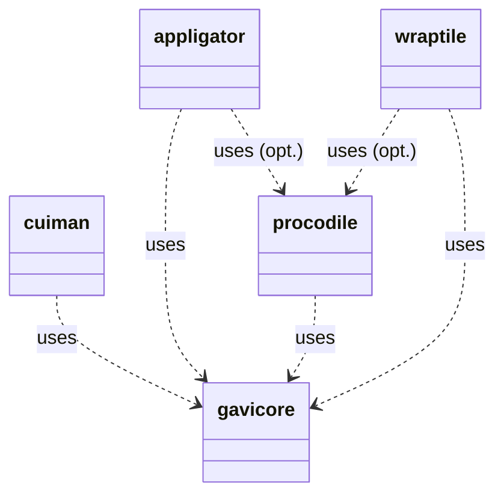
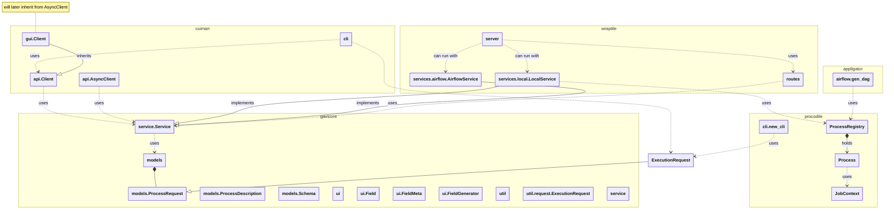
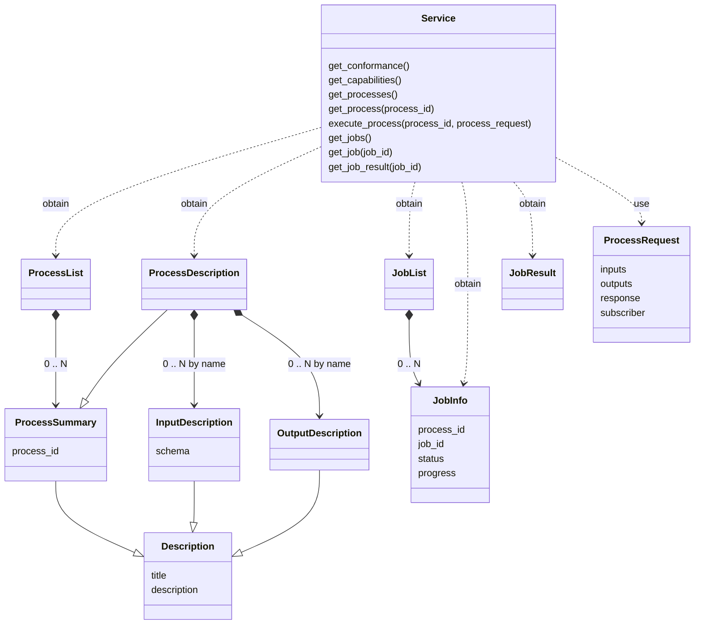
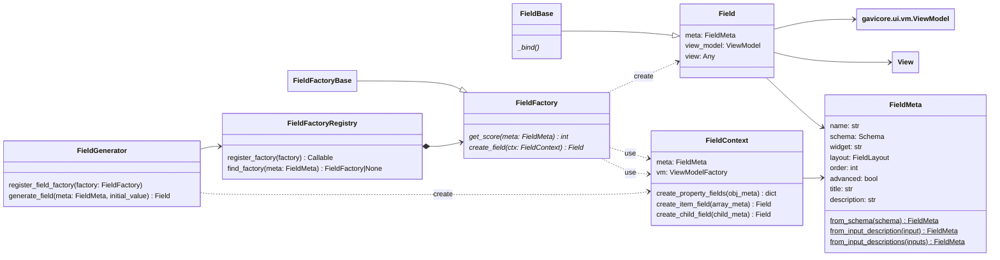
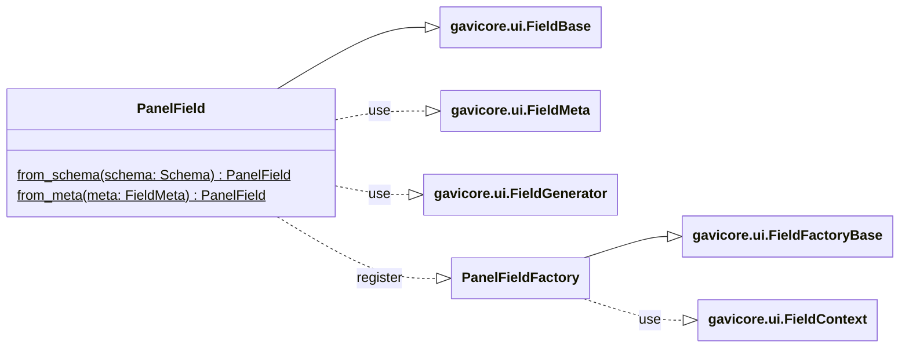
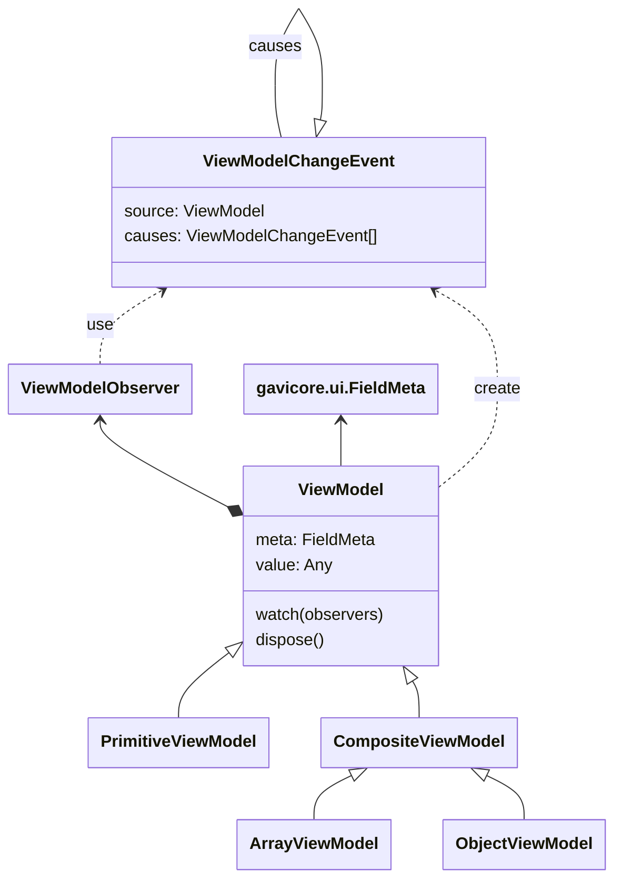

# Architecture

_This chapter is currently just a collection of design diagrams. Perhaps it will be of interest to some._

_Note, should the following diagram code not render, copy it 
into the [mermaid](https://www.mermaidchart.com/) editor._

## Package Dependencies




## Core Classes



## Gavicore - Service Interface

Given here is the design used in package `gavicore.service`.



## Gavicore - Generating UIs

The `gavicore.ui` package contains the code to generate widgets and panels 

- from plain OpenAPI Schema instances of type `gavocore.models.Schema`, and
- from `gavicore.models.InputDescription` instances contained in
  a `gavicore.models.ProcessDescription` instance.

The `gavicore.ui` machinery is used by `cuiman.gui` to generate UIs for selected
processes.

The core framework is neutral with respect to the target UI library.
The `gavicore.ui.providers.panel` package contain a `PanelField` implementation 
that generates UIs for the [Panel](https://panel.holoviz.org/) library.

### `gavicore.ui.field` 

The machinery that can generate UIs from OpenAPI Schemas.
Entry points are `FieldGenerator` with one or more registered 
`FieldFactory` implementations:

```python
from gavivore.models import Schema
from gavivore.ui import FieldGenerator, FieldMeta

# what is needed:
# --- factories that generate fields from metadata (required)
from mylib import MyFieldFactory1, MyFieldFactory2
# --- observer for value changes in the generated UI tree (optional)
from mylib import MyViewModelObserver
# --- a top-level field metadata, e.g. from OpenAPI Schema (required)
my_schema = Schema(**{...})
my_field_meta = FieldMeta.from_schema(my_schema)
# --- an initial value for the UI (optional)
my_value = {}

# Generator setup:
generator = FieldGenerator()
generator.register_field_factory(MyFieldFactory1())
generator.register_field_factory(MyFieldFactory2())
# Generator usage:
field = generator.generate_field(my_field_meta)

# Then:
# --- populate UI fields
field.view_model.value = my_value
# --- observe value changes in UI fields
my_observer = MyViewModelObserver()
field.view_model.watch(my_observer)
# --- and do something to render field.view
```



### `gavicore.ui.providers.panel`

Implements `PanelField` and `PanelFieldFactory` for generating UIs 
from OpenAPI Schema targeting the [Panel](https://panel.holoviz.org/) library.

This means, the `PanelField.view` object will be a widget-like component that 
can be used as part of a larger UI developed with [Panel](https://panel.holoviz.org/).



###  `gavicore.ui.vm` 

Defines class `ViewModel` which is used to propagate value into the UI and 
to observe value changes in the UI fields.



