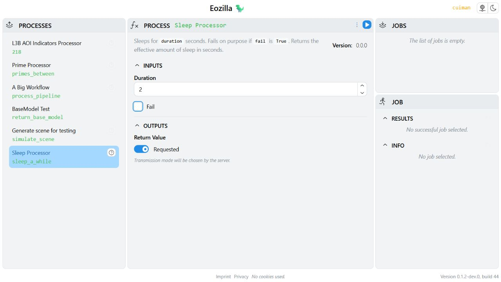

# App guide

Cuiman launches Eozilla App to browse processes, edit inputs, submit jobs, and
inspect their status and results. The App works in a browser or inside Jupyter.

## Open in a browser

Follow the [local service setup](cli.md#start-and-configure), then run:

```bash
--8<-- "examples/guides/cuiman/cli.sh:app"
```

Keep the terminal running while using the App; press Ctrl+C to stop its server.
The App uses the saved Cuiman service configuration. For a service requiring
interactive sign-in, use `cuiman login` first; see
[Authentication](../authentication.md).

## Choose a process and submit a job

Choose **Sleep Processor** (`sleep_a_while`) from the process list. Set
**duration** to `2`, leave **fail** disabled, and execute the request. Follow
the new job's status in the jobs view; once successful, inspect its result,
the effective sleep duration. Enable **fail** for a separate execution if you
want to explore error details.



For a dataset example, choose **Generate scene for testing** (`simulate_scene`).
Use the small inputs from the [result opener guide](openers.md#prepare-a-small-scene).
The result is a reference to a Zarr dataset; that guide explains how to open it
from Python. Available processes and fields depend on your service.

## Launch from Python

The reusable [App example](https://github.com/eo-tools/eozilla/blob/main/examples/guides/cuiman/app.py)
creates a client for the local service and returns both handles:

```python
--8<-- "examples/guides/cuiman/app.py:open"

client, app = open_app()
```

For another service, replace the explicit URL and authentication settings with
your [configuration](../configuration.md). Call `client.login()` before
`show_app()` if interactive authentication is needed.

From the repository root in `pixi shell`, the complete script keeps the App
running until Ctrl+C and then releases its resources:

```bash
--8<-- "examples/guides/cuiman/cli.sh:python-app"
```

## Embed in Jupyter

As an alternative to the browser launch above, start a notebook session whose
working directory is the repository root and run:

```python
from cuiman import Client
from cuiman.app import App
from examples.guides.cuiman.app import close_app, open_app, set_duration

client, app = open_app(display="notebook")
```

Keep `client` and `app` for subsequent cells. `client.show_app()` also supports
`display="auto"`, which embeds in a notebook and opens a browser otherwise.
For remote Jupyter deployments, see
[notebook proxy configuration](../configuration.md#remote-notebooks).

## Use JupyterHub authentication

In a Hub deployment configured to expose an upstream token accepted by the
processing service, use the same client for Python calls and the embedded app:

```python
from cuiman import Client

client = Client(
    api_url="https://processing.example.org/api",
    auth={"auth_type": "jupyter"},
)
client.login()  # Verify token availability before opening the app.
app = client.show_app(display="notebook")
```

Use `auth={"auth_type": "auto"}` for discovery with anonymous access when no
mechanism is detected, or `none` to skip discovery entirely. The app uses the
current Hub token for every processing request without sending it to the browser.
See [Hub setup and authentication](../authentication.md#jupyterhub-discovery-and-required-authentication)
for the required permissions and refresh configuration. For an async client,
await `login()` and keep its owning event loop running while using the app.

When finished, stop the app and then close the client:

```python
app.serve_result.stop()
client.close()  # await client.close() for AsyncClient
```

This does not sign you out of JupyterHub.

## Update inputs from Python

After opening Sleep Processor in the App, update the same form from Python:

```python
--8<-- "examples/guides/cuiman/app.py:request"

set_duration(app, duration=5)
```

The helper preserves the request's other inputs and outputs. It updates the
form without submitting a job. You can also edit nested state directly using
`app.process_requests.sleep_a_while.inputs.duration = 5`.

## Close the App

When finished with an App launched from Python or Jupyter:

```python
--8<-- "examples/guides/cuiman/app.py:close"

close_app(client, app)
```

Closing the browser tab alone does not stop the Python server.

See the [Eozilla App overview](../../eozilla-app/index.md) for architecture and
development documentation. The
[original GUI notebook](https://github.com/eo-tools/eozilla/blob/main/notebooks/cuiman-gui.ipynb)
remains available as a historical example. Its introductory `show()` and
`show_jobs()` descriptions refer to the legacy GUI; use `show_app()` with the
current client.
