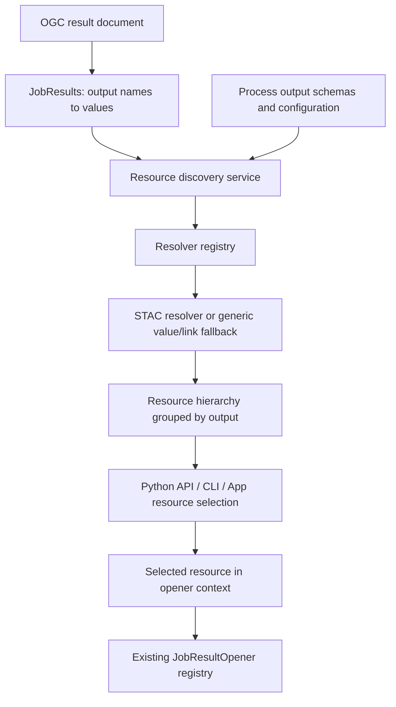

# Job Result Resources and STAC Discovery

Status: proposed design; the new interfaces and commands below are not implemented.

STAC type names (Item, ItemCollection, Collection, Catalog, and Asset) are
capitalized in prose, while code identifiers and JSON keys retain their
specified spelling.

This specification defines how Cuiman discovers and opens resources from
OGC API - Processes job outputs that contain or reference STAC Items and related
STAC containers. It applies across processing services and application domains.
The description of the existing architecture is based on the Eozilla checkout
at `d72c016`. Requirements expressed as “must” or “should” below describe the
proposed Cuiman behavior, unless explicitly attributed to an external standard.

## 1. Problem and requirements

Processes can produce STAC Items as job outputs, either directly or through
links to Items, ItemCollections, or other STAC containers. The Items describe
Assets held in object storage or other locations. Cuiman has pluggable
`JobResultOpener` implementations, but needs a discovery step to answer
**what is available to open?** before choosing how to open it.

For example, an agricultural monitoring application such as Sen4CAP may consume
STAC Items describing derived vegetation products. The same workflow applies
to any process producing STAC-described results.

The design questions and proposed answers are:

| Question or requirement | Proposed approach |
| --- | --- |
| Which OGC model should represent output references? | Use the standard OGC `Link`, represented by `gavicore.models.Link`. |
| How should output names and values be structured? | Preserve the `JobResults` mapping; attach a separate discovery hierarchy to each output. |
| How can Python API, CLI, and GUI reuse this functionality? | Share the resource contract and discovery policy; keep rendering and runtime-specific opening separate. |
| How do existing openers learn which Assets exist? | A resolver enumerates resources; a selected resource is adapted into an opener context. |
| How can Cuiman recognize STAC from other services? | Prefer process output schemas, then use media type hints and bounded structural inspection. |
| Which STAC hierarchy levels should services return? | Prefer Item or ItemCollection; support Collection and Catalog with explicit traversal limits. |

The design must retain ordinary links, inline values, and qualified values. It
must work without project-specific output names, URL patterns, or service IDs.
Discovery must not download Asset payloads or open datasets merely to list them.

### Required user operations: outputs, Items, Assets

The following three operations must be available as distinct steps through the
Python API, CLI, and GUI:

1. **R1 — List job outputs:** list every output name together with its original
   value, including `Link` objects. This step requires no STAC discovery.
2. **R2 — List Items of an output:** given a selected output whose value is a
   recognized STAC object, list the available Items. In particular, support a
   `Link` whose `href` points to an ItemCollection. A single Item output produces
   a one-Item listing. Collection and Catalog outputs follow the explicit,
   bounded traversal policy below. Keep Item identity and output ownership in
   the listing, and expose pagination or incomplete discovery.
3. **R3 — List Assets of an Item:** given a selected Item, list all its Assets,
   displaying each Asset's **title, role(s), data type, and opener availability**.
   Preserve the Asset key as its identifier and title fallback. Show missing
   roles or type as unspecified, and keep Assets without an opener visible.

For R3, “data type” means the Asset's advertised format/media type (for example,
GeoTIFF or `image/tiff`), with additional data-type metadata when available.
An opener's Python return type, such as `xarray.Dataset`, is separate information;
neither the file format nor a pixel/column type should be inferred from it.

**P1 — Optional preview:** users should also be able to preview an Asset when a
suitable preview action is available. This is a desirable enhancement; R1–R3 must
work independently of preview support. Preview availability and opener
availability are separate capabilities, described in section 7.

Scope is discovery, selection, and integration with opening. Implementing a full
STAC browser, changing the processing service protocol, adding data readers, and
bulk downloading are outside this proposal.

## 2. Current repository architecture

The following existing concepts determine the terminology and integration points:

| Existing component | Relevant behavior |
| --- | --- |
| `gavicore.models.JobResults` | A root model containing `dict[str, JobResult]` or `None`; `JobResult` includes `Link`, `QualifiedValue`, and `InlineValue`. |
| `gavicore.models.Link` | Carries `href`, optional `rel`, `type`, `title`, and `hreflang`; also supports the Eozilla `x-options` extension. |
| `OutputDescription.schema_` | Python attribute for the serialized `schema` field of a process output. |
| `Client` / `AsyncClient` | Provide synchronous/asynchronous `get_job_results()` and `open_job_result()`. |
| `JobResultOpenContext` | Contains job results, configuration, process description, output selection, desired data type, media type override, and opener options. |
| `JobResultOpener` | Supplies `is_usable()`, `accept_job_result(ctx)`, and `open_job_result(ctx)`. Acceptance is a candidate check, not a guarantee that opening will succeed. |
| `JobResultOpenerRegistry` / `ClientConfig` | Register built-ins and application extensions; configuration classes have isolated registries, with later registrations taking precedence. |
| CLI `get-job-results` | Retrieves and renders the result mapping using existing output renderers. |
| Eozilla App `Service` and result views | Fetch `JobResults`, render each output, and provide inspection/copy/link actions. The browser app is a separate nested checkout. |

`JobResultOpenContext.output_link` already normalizes link-like values, including
raw dictionaries in some deserialization paths. `output_media_type` currently
uses an explicit override or typed `Link`/`QualifiedValue` metadata. The new
discovery boundary should consistently normalize these cases before inspection.

The default registry registers GeoPandas, pandas, and xarray openers. An image
opener implementation also exists, but is not registered by default. Consequently,
a thumbnail, TIFF, or object-storage URL being discovered does not establish that
the current environment can open it.

Relevant repository sources:

- [Gavicore models](../../gavicore/src/gavicore/models.py)
- [Client convenience methods](../../cuiman/src/cuiman/api/client_mixin.py)
- [Asynchronous methods](../../cuiman/src/cuiman/api/async_client_mixin.py)
- [Opener context](../../cuiman/src/cuiman/api/opener/context.py)
- [Opener contract and dispatch](../../cuiman/src/cuiman/api/opener/opener.py)
- [Opener registry](../../cuiman/src/cuiman/api/opener/registry.py)
- [Customization](customization.md) and [API reference](api.md)
- [CLI implementation](../../cuiman/src/cuiman/cli/cli.py)
- [App service architecture](../eozilla-app/service-provider.md)

The current browser app, including launches from Python, is the GUI target.
The deprecated legacy Cuiman GUI is not the target of this proposal.

## 3. Preserve the OGC result contract

The OGC result-document representation maps output identifiers to inline or
referenced values. Preserve that mapping and use standard `Link` objects for
references. This specification addresses that representation; raw or multipart
responses remain the responsibility of the existing transport layer.
See [OGC API - Processes Part 1](https://docs.ogc.org/is/18-062r2/18-062r2.html)
and its [results schema](https://schemas.opengis.net/ogcapi/processes/part1/1.0/openapi/schemas/results.yaml).

For example, a result document can contain two independent outputs:

```json
{
  "result": {
    "href": "https://example.org/jobs/123/item.json",
    "type": "application/geo+json",
    "title": "Vegetation result"
  },
  "report": {
    "href": "https://example.org/jobs/123/report.pdf",
    "type": "application/pdf",
    "title": "Processing report"
  }
}
```

`result` remains a link-valued process output after discovery. The STAC Item and
its Assets are a derived view associated with that output. Do not replace the
original value, promote Asset keys into the top-level mapping, or combine
unrelated process outputs into a synthetic STAC Collection.

No `StacResultLink`, new mandatory link relation, or proprietary media type is
required. `type` describes the linked representation. Existing standard link
fields retain their meaning. Eozilla extensions such as `x-options` are optional
integration details and must not be required for STAC recognition.

A direct link to a TIFF, PDF, or other file remains a valid ordinary output. It
does not become a standalone STAC Asset merely by having an `href` and `type`.

## 4. Recommended STAC output policy

| Representation behind an output link | Producer recommendation | Default Cuiman discovery |
| --- | --- | --- |
| **Item** | Primary representation for one logical result with related files. | Read the Item and enumerate its `assets`. Do not traverse its parent or Collection automatically. |
| **ItemCollection** | Preferred for multiple result Items, for example multiple dates or tiles. | Inspect embedded Items and their Assets within configured limits. Expose continuation when paginated or truncated. |
| **Collection** | Supported when the process creates or publishes a dataset. | Show dataset metadata and traversal actions; enumerate member Items only on explicit traversal. |
| **Catalog** | Supported primarily for interoperability with external services. | Show the container and navigation links; do not crawl descendants automatically. |
| **Asset object** | Not a standalone STAC output entity. | Discover Assets beneath their owning Item and retain that ownership. Ordinary direct file links remain supported. |

An Item groups the files describing one result. An ItemCollection contains Items
as a GeoJSON `FeatureCollection`; it is distinct from a Collection describing a
dataset. These distinctions follow the [Item specification](https://github.com/radiantearth/stac-spec/blob/v1.1.0/item-spec/item-spec.md),
[ItemCollection fragment](https://github.com/radiantearth/stac-api-spec/blob/v1.0.0/fragments/itemcollection/README.md),
[Collection specification](https://github.com/radiantearth/stac-spec/blob/v1.1.0/collection-spec/collection-spec.md),
and [Catalog specification](https://github.com/radiantearth/stac-spec/blob/v1.1.0/catalog-spec/catalog-spec.md).
The traversal defaults above are Cuiman policy.

STAC also permits Collection-level `assets`. Preserve them as Assets owned by
the Collection when present, without traversing member Items. The recommendation
to use Items for individual process results does not prohibit this standard
feature. Collection `item_assets` entries describe Assets that may occur in Items; they are not
concrete downloadable Assets and must not be offered as such.

### Example: one logical result

An illustrative document at `https://example.org/jobs/123/item.json`:

```json
{
  "type": "Feature",
  "stac_version": "1.1.0",
  "id": "ndvi-2026-09-01",
  "geometry": null,
  "properties": {"datetime": "2026-09-01T00:00:00Z"},
  "links": [
    {
      "rel": "self",
      "href": "https://example.org/jobs/123/item.json",
      "type": "application/geo+json"
    }
  ],
  "assets": {
    "data": {
      "href": "https://storage.example.org/jobs/123/ndvi.tif",
      "type": "image/tiff; application=geotiff; profile=cloud-optimized",
      "title": "NDVI raster",
      "roles": ["data"]
    },
    "thumbnail": {
      "href": "preview.png",
      "type": "image/png",
      "title": "Preview",
      "roles": ["thumbnail"]
    }
  }
}
```

The relative thumbnail URL resolves against the containing document's base URI,
giving `https://example.org/jobs/123/preview.png`. The original Asset description
and resolved access link should both remain available. Asset roles and metadata
follow the [STAC Asset specification](https://github.com/radiantearth/stac-spec/blob/v1.1.0/commons/assets.md).

The discovery view is:

```text
JobResults
  result -> original Link
    STAC Item ndvi-2026-09-01
      data       [data]       image/tiff; ...
      thumbnail  [thumbnail]  image/png
  report -> original Link   application/pdf
```

For several Items, the linked document uses `type: "FeatureCollection"` and a
`features` array containing the full Item objects. The hierarchy gains an
ItemCollection node, then one node per Item. Repeated Asset keys such as `data`
remain distinct because selection includes their owning Item and output.

## 5. Architecture: transport, discovery, selection, opening



Discovery belongs in Cuiman, alongside the opener extension mechanism. Gavicore
continues to own the OGC transport models. STAC parsing belongs in a resolver;
generic resource consumers must not need STAC-specific classes.

### 5.1 Resource model

Retain the proposed name `JobResultResource`: it matches `JobResultOpener` and
`JobResultOpenContext`. A candidate package is `cuiman.api.resource`, exported
through `cuiman.api` once stabilized.

The following is a conceptual data contract, not a final constructor signature:

| Field | Meaning |
| --- | --- |
| `id` | Opaque selector unique within the job's discovery view; independent of temporary signed URLs. |
| `output_name` | Original process output name; required on every resource. |
| `kind` | Extensible semantic kind, initially `value`, `link`, `stac-item`, `stac-item-collection`, `stac-collection`, `stac-catalog`, or `asset`. |
| `key` | Local source key, such as an Asset key or Item identifier, when available. |
| `link` | Optional normalized `gavicore.models.Link`; absent for embedded or inline resources without their own URL. |
| `media_type` | Effective representation type; retain media type parameters and record inference/overrides. |
| `title`, `description`, `roles` | Display and selection metadata; roles are a list, not a single classification. |
| `metadata` | JSON-compatible source metadata, including STAC IDs, version, extensions, and ownership information. |
| `children` | Already discovered resources; containment is explicit. |
| `discovery_state` | `unresolved`, `partial`, `complete`, or `error`; an empty child list alone does not imply completeness. |
| `continuation` | Optional opaque token for the next page or bounded expansion step. |
| `diagnostics` | Per-resource detection, access, validation, or traversal messages. |

Enrich Asset listings with a separate, serializable capability assessment keyed
by resource ID: opener availability, candidate opener identifiers/display names,
and preview availability/actions. These are computed for the current runtime,
configuration, and requested return type, not copied from STAC metadata. Keeping
them separate allows discovery results to be reused when available openers change.

Return a `JobResultResourceListing` with an `outputs` mapping from original output
names to root resources and listing-level diagnostics. Retain the original
`JobResults` separately. A linked STAC Item can itself be its output's root
resource; the UI renders the output grouping above it. A plain PDF link is a
leaf root resource. Inline values remain accessible through the original results.

Resource identity must preserve output and ancestry, including Collection identity
where needed. Asset keys alone and Item IDs alone are insufficient. Expose an
opaque selector and a human-readable path; the final escaping and collision
scheme is an implementation decision. Refreshed signed links must not invalidate
otherwise unchanged selectors.

The hierarchy is a view over a potentially cyclic graph. Preserve relevant
navigation links as metadata or deferred actions; do not embed parent/root links
as child trees. Fetching the same document can be deduplicated while preserving
its appearance under multiple outputs.

### 5.2 Resolver contract and registry

Introduce `JobResultResourceResolver` and a matching registry. A conceptual
asynchronous contract is:

```python
class JobResultResourceResolver:
    async def accept(self, ctx) -> bool:
        """Identify whether this resolver can interpret the candidate resource."""

    async def resolve(self, ctx) -> JobResultResource:
        """Describe the resource and its permitted children without opening data."""
```

The resolve context should carry original results, output name and description,
the candidate resource, base URI, optional cached document, access/session
services, traversal policy, cancellation, and a request budget. The same context
supports initial outputs and explicit expansion of descendant containers.

Contract requirements:

1. Use cheap schema/media hints first. If `accept()` needs structural inspection,
   fetch through the shared bounded document loader and reuse that response in
   `resolve()` and other candidates. Do not fetch once per resolver.
2. Resolve metadata only. Asset payloads belong to open/download actions.
3. Use deterministic precedence: configured specialized resolvers before the
   generic fallback. One selected resolver owns a node's semantic expansion.
4. Distinguish “not recognized” from “recognized but inaccessible/invalid.” Keep
   the original output visible and attach errors; one failure must not hide
   successful sibling resources.
5. Support cancellation, pagination, depth/Item/request/response-size limits,
   cycle detection, and explicit partial results.

A `StacJobResultResourceResolver` can handle the four supported container kinds.
Separate per-kind implementations are optional internal structure. A generic
fallback exposes ordinary links and values without claiming STAC semantics.

Mirror `ClientConfig.extra_job_result_openers` with a proposed
`extra_job_result_resource_resolvers` class attribute and registration/unregister
API. Preserve configuration-class isolation and deterministic override behavior;
do not mutate global defaults when importing an application-specific client.
Concrete registry signatures remain to be agreed.

## 6. STAC detection and traversal

### 6.1 Process output schema first

Inspect `process_description.outputs[output_name].schema_` when available. Known
STAC schema references or an unambiguous schema composition can select the STAC
resolver before downloading the result. For example, a process description
fragment can advertise the logical Item value:

```json
{
  "outputs": {
    "result": {
      "title": "Vegetation result",
      "schema": {
        "$ref": "https://schemas.stacspec.org/v1.1.0/item-spec/json-schema/item.json"
      }
    }
  }
}
```

This describes the output's content, which may be transmitted by reference. It
does not require the result document's `Link` wrapper to validate as a STAC Item.
A schema describing only a generic `Link` provides no STAC target-type evidence.
OGC output schema requirements are described in
[Part 1, process description](https://docs.ogc.org/is/18-062r2/18-062r2.html#_ogc_process_description).

Inspect recognized references without fetching arbitrary schema graphs. Local
references and compositions need bounded resolution. A union that allows both
STAC and another representation is only a candidate signal; inspect the actual
output. A schema hint is not proof that the returned document conforms.

`gavicore.models.Schema` models OpenAPI 3.0, while STAC schemas use JSON Schema.
Preserve reference identifiers and extension keywords; full STAC validation needs
a validator supporting the advertised schema dialect. Do not infer full schema
validation support from Gavicore's model acceptance.

### 6.2 Media type and structural fallback

If schema evidence is absent or insufficient:

- Treat `application/geo+json`, `application/json`, and appropriate `+json`
  representations as candidates. Normalize the base media type while retaining
  its parameters. Inspect link metadata and the fetched response Content-Type.
- Media type alone must never classify a document as STAC. Ordinary GeoJSON has
  the same media type as a STAC Item.
- Recognize an Item from `type: "Feature"`, a string `stac_version` and `id`,
  object `properties` and `assets`, array `links`, and the required geometry
  member. These are recognition checks; full validation remains distinct.
- Recognize ItemCollections from `type: "FeatureCollection"` and a `features`
  array of recognized STAC Items. Do not require a top-level `stac_version`.
  An empty FeatureCollection needs schema or other explicit STAC context;
  otherwise report ambiguity. Mixed STAC/non-STAC members are diagnostic cases,
  not evidence that the entire collection conforms.
- Recognize Collection/Catalog using their distinct `type`, `stac_version`, and
  required core structure; Collection recognition additionally checks dataset
  fields such as `extent` and `license`.
- For missing or incorrect media types, allow a bounded JSON probe when schema
  evidence or an explicit user/provider hint warrants it. Do not probe arbitrary
  binary outputs automatically. Output names and `.json` suffixes are only hints.

Record detection evidence and warnings. Unsupported versions or extensions
should preserve inspectable core metadata where possible and clearly state
limits. If a schema declares STAC but the document is unrelated JSON, report the
mismatch and keep the original link; never fabricate Assets.

### 6.3 Bounded expansion

For Items, enumerate embedded Asset metadata only. For ItemCollections, enumerate
embedded Items within limits; retain a continuation for remaining members or
advertised next pages. Default listing must not silently fetch every page.
Pagination adapters must respect advertised request semantics and stop on
repeated continuations.

Collections require an explicit request to list members, using advertised static
`item` links or supported API `items` endpoints. Catalogs expose explicit
navigation through relevant `child`/`item` links. Do not invent endpoint paths or
follow every link relation. No automatic traversal of `root`, `parent`, or
`collection` links, and no automatic deep crawling from a Catalog result.

Bounded expansion must return `partial` plus the reason when limits are reached.
A successfully resolved empty ItemCollection is `complete` with zero children;
an inaccessible Collection is not an empty dataset.

## 7. Feed discovered Assets into existing openers

The selected Asset supplies its own resolved URL, media type, and access options.
The original STAC link identifies its source container and remains available as
provenance.

Propose an optional `resource` on `JobResultOpenContext`, leaving existing opener
method signatures intact. Without it, preserve current behavior. With it:

- `job_results` retains the complete original mapping and `output_name` retains
  the owning process output name.
- `output_link` and the effective selected value expose the selected resource's
  normalized link for existing path-based openers.
- `output_media_type` uses the explicit override first, then selected-resource
  metadata; it must not inherit the STAC container's GeoJSON type for an Asset.
- The original process `output_description` remains available as source context;
  it must not be presented as the selected Asset's schema.
- Requested `data_type` and opener-specific `options` retain their meaning.
  Roles and source metadata remain available through `resource`.

Offer selection through a new `open_job_result_resource()` method so that callers
of existing `open_job_result()` do not acquire implicit Asset-selection behavior.
An adapter can create the resource-aware context and dispatch through the
existing registry. Built-ins that inspect `ctx.output_link` benefit directly.
Custom openers that inspect `ctx.job_results` themselves need to recognize the
resource selection or decline it; they must not silently open the container or a
different Asset. Final adapter compatibility is an implementation review item.

Expose a candidate-opener query for selected resources. Discovery lists every
resource even if no usable opener accepts it. Candidate checks must not open
payloads, and the UI must distinguish a potential action from successful access.
Preserve dispatch precedence and opening errors, including optional dependencies,
unsupported formats, and storage authentication failures.

### Opener availability in Asset listings

R3 requires an assessment for each listed Asset, not only after the user selects
one to open. Use `is_usable()` and `accept_job_result()` with the selected Asset's
context to determine candidate openers. Expose these states in both structured
results and user-facing listings:

- **Available:** at least one usable registered opener accepts the Asset; include
  its display name and identifier so callers can inspect or choose candidates.
- **Unavailable:** the assessment completed and no usable opener accepts it.
  Include a reason where known, such as a missing optional dependency.
- **Unknown:** assessment is pending, failed, or cannot be performed in this
  runtime. Do not display this as “no opener.”

“Available” means a candidate opener exists, not that the Asset has been fetched
or successfully opened. Candidate assessment must not read Asset payloads.
Assessments should reuse metadata and be refreshable when configuration,
dependencies, credentials, or requested return types change. The GUI identifies
whether an action runs in the browser or its connected Python environment.

### Optional Asset previews

A preview action should show a supported representation of the selected Asset,
such as an image, map, or small table, without requiring users to choose a full
opening workflow. A browser renderer may provide preview even without a Python
opener; a Python opener may be available without any suitable preview renderer.
Report preview availability independently using available/unavailable/unknown
states and an action descriptor.

Request preview content only on a user preview action, with size/time limits,
loading/error feedback, and cancellation. Listing Assets must not automatically
download them to generate previews. A supplied thumbnail may be displayed as an
Item preview; do not imply it depicts a particular sibling Asset unless that
association is known. A preview failure leaves the Asset listing and its other
actions usable. Preview adapters and their initial supported formats remain an
implementation choice.

Do not choose the first Asset silently when several are present. Roles can help
sort or recommend a selection, but a `data` role does not imply uniqueness or
reader support. Opening a container itself remains a separate explicit choice
when an appropriate opener is installed.

## 8. Python API, CLI, and GUI behavior

### Python API

Add equivalent methods on `Client` and `AsyncClient`; the synchronous client
should wrap the same asynchronous discovery implementation, following existing
Cuiman conventions. Illustrative proposed usage:

```python
raw = await client.get_job_results(job_id)  # existing, unchanged
for output_name, value in (raw.root or {}).items():  # R1
    print(output_name, value)

# Proposed convenience views over the same generic discovery service.
items = await client.get_job_result_items(job_id, output_name="result")  # R2
item = items.resources[0]  # caller selection; page may also be empty
assets = await client.get_job_result_assets(job_id, item_id=item.id)  # R3
for asset in assets.resources:
    capabilities = assets.capabilities[asset.id]
    print(asset.title or asset.key, asset.roles, asset.media_type,
          capabilities.opener_availability)

asset = next(asset for asset in assets.resources if asset.key == "data")
opened = await client.open_job_result_resource(job_id, resource_id=asset.id)

# Explicit bounded expansion; useful for a Collection or Catalog node.
expanded = await client.get_job_result_resources(
    job_id, resource_id=container_id, continuation=continuation
)
```

The proposed Item and Asset convenience methods return scoped pages with
`resources`, `continuation`, completeness, and diagnostics; Asset pages also
carry the per-resource capability assessments. They reuse
`get_job_result_resources()` and its resolver registry rather than introducing
independent STAC discovery logic. Item listing includes the selected output's
root when that root is itself an Item. Non-STAC outputs return an explicit
unsupported-kind result rather than an apparently empty Item listing.

The proposed discovery method accepts output/resource selection and traversal
limits, returns JSON-serializable resource descriptions, and has a refresh option.
The first version should require successful job results and return a clear status
error for unfinished/failed jobs. Preserve existing polling behavior on
`open_job_result()`; whether resource opening also waits is an open question.

### CLI

Follow the repository's flat, hyphenated command names. Keep the current
`cuiman get-job-results JOB_ID` behavior. Proposed commands, not current CLI syntax:

```text
cuiman get-job-results JOB_ID
cuiman get-job-result-items JOB_ID --output-name result
cuiman get-job-result-assets JOB_ID --item-id ITEM_RESOURCE_ID
cuiman get-job-result-resources JOB_ID
cuiman get-job-result-resources JOB_ID --output-name result --format json
cuiman get-job-result-resources JOB_ID --resource-id RESOURCE_ID --expand
cuiman open-job-result-resource JOB_ID --resource-id RESOURCE_ID
```

The default listing should display output name, resource selector/path, title,
kind, media type, roles, and discovery status. For example:

```text
OUTPUT  RESOURCE PATH                    KIND       ROLES      STATUS
result  ndvi-2026-09-01                   stac-item             complete
result  ndvi-2026-09-01 / data            asset      data       complete
result  ndvi-2026-09-01 / thumbnail       asset      thumbnail  complete
report  report                           link                  complete
```

The proposed Item/Asset commands implement R2/R3 as scoped views of generic
discovery. The Asset command must show title, role(s), data type, and opener
availability in its normal listing, not only in JSON or a details view. Example
column layout (capability values depend on the installed/configured adapters):

```text
ASSET      TITLE        ROLES      DATA TYPE    OPENER                 PREVIEW
data       NDVI raster  data       GeoTIFF      Available: Raster      Available
thumbnail  Preview      thumbnail  image/png    Unavailable            Available
metadata   metadata     metadata   unspecified  Unknown                Unavailable
```

JSON output must retain the complete media type, candidate opener identifiers,
assessment states/reasons, and source identity. A friendly format label must not
discard media type parameters. CLI preview, if provided, can launch a supported
viewer; listing and opener assessment must work without a graphical environment.

Show copyable opaque selectors in the detailed or JSON view. Flattening is a
presentation option and must retain ancestry. Explicit selection is required
when ambiguous; scripts receive structured errors rather than prompts. An open
command also needs a defined output destination or application action, since a
Python object alone has no CLI presentation; its exact options remain open.

### GUI / Eozilla App

Keep output-name groups and existing raw-output inspection/copy actions. Add
lazy resource trees showing Items and Assets, with titles, roles, types, and
available actions. Collection and Catalog rows offer explicit expansion; partial
results show “Load more.” Distinguish loading, empty, failed, and unsupported
states. A discovery failure must not remove the original output link.

The required navigation is **job outputs and values → Items of a selected output
→ Assets of a selected Item**. Each stage must be directly inspectable; a
flattened Asset list alone does not satisfy R2. ItemCollection output links must
expand to an Item listing before Asset selection. A direct Item output can show
its single Item and Assets together while preserving the same selection model.

The Item's Asset list must show title (falling back to Asset key), all roles,
data type, and opener availability on each row. Allow inspection of candidate
openers and reasons for unavailable/unknown status. Provide a separate Preview
action when supported, with the bounded behavior in section 7. Preview failure
or absence must not hide an Asset or block other available actions.

The app's `Service` boundary should expose the same serializable resource
contract. In a Python-launched app, a proposed local discovery/action adapter can
reuse the Python client session, resolvers, and opener registry. The current
processing-service proxy does not itself supply this discovery API.

A standalone browser app cannot execute Python opener classes. It needs either
an advertised companion discovery service or browser resolver/action adapters
with equivalent contracts and traversal policy. Share fixtures and acceptance
cases across implementations. Browser actions can include supported preview,
download, or opening a link; Python-backed actions need an explicit result
presentation/export contract. Do not promise every Python opener in every GUI.

## 9. Interoperability and access

- **Service independence:** no project-specific IDs, output names, Asset keys, or
  hostnames in generic detection. Provider overrides remain optional plugins.
- **Representation preservation:** retain inline/qualified outputs and generic
  links. Embedded STAC JSON can use the same structural resolver without a
  download; relative links require a known base URI.
- **URLs:** resolve relative references using the effective containing-document
  base, including redirects and appropriate self-link context for embedded
  Items. Report an unresolved base instead of guessing. Preserve signed query
  parameters exactly; do not use signed URLs as resource identity.
- **Authentication:** processing API, STAC host, and Asset store may have different
  credentials. Reuse configured sessions only within their authorized scope;
  do not forward processing tokens to arbitrary linked hosts or redirects.
  Credential acquisition and URL renewal belong to access/provider adapters.
- **Storage:** HTTPS links, signed links, and schemes such as `s3://` are resource
  locations; opening depends on installed readers and configured storage access.
  Missing access leaves an inspectable resource and an actionable diagnostic.
- **Browser constraints:** CORS, download behavior, and storage access can differ
  from Python. The existing API proxy must not be assumed to proxy arbitrary
  STAC or Asset hosts; any companion adapter needs scoped URL handling.
- **Caching:** share fetched metadata within a discovery operation and support
  refresh. Cache by resource and access context, honor expiry/HTTP validators
  where available, and avoid exposing credentials or signed URLs in diagnostics.
- **Payloads and options:** list from metadata without Asset probes. Do not treat
  untrusted STAC extension fields or remote `x-options` as executable instructions
  or unrestricted local reader options.

## 10. Acceptance criteria for implementation

These are future verification scenarios; this document introduces no code changes.

1. A mapping containing an Item link, PDF link, and inline value retains every
   original output and exposes the Item's Assets under its own output only.
2. A plain GeoJSON Feature is not classified as STAC. Missing-schema STAC Items
   are recognized structurally; misleading schema hints produce diagnostics.
3. ItemCollections expose multiple Items, including duplicate Asset keys under
   different Items. Empty, mixed, paginated, and limit-truncated cases are explicit.
4. Collection/Catalog listing does not fetch member documents until requested;
   bounded explicit expansion terminates even with cycles or repeated pages.
5. Choosing an Asset sends its URL and media type to an opener while preserving
   the original output name, job results, and source metadata. Existing opening
   calls without a resource selection retain their behavior.
6. Unsupported Assets remain listed. Discovery succeeds without optional opener
   dependencies or Asset payload downloads; opening failures remain separate.
7. Relative URLs, expired signed URLs, separate storage credentials, and a failed
   sibling resource yield predictable results without hiding available siblings.
8. Python, CLI JSON, and GUI adapters represent the same output hierarchy,
   selections, completeness, and errors. Resolver configuration is isolated per
   application configuration class.
9. **R1–R2:** users can first list output names and original values without
   dereferencing STAC links, then select an ItemCollection output to list its
   Items, and select an Item independently. A direct Item output yields one
   Item; non-STAC outputs, empty pages, and partial listings are distinguishable.
10. **R3:** each selected Item's Asset listing shows title/key fallback, all roles,
    advertised data type or unspecified, and available/unavailable/unknown opener
    status. Candidate names and assessment reasons are accessible. An accepting
    opener, no usable opener, and a failed assessment produce distinct states
    without fetching Asset payloads.
11. **P1, when implemented:** a supported Asset can be previewed on request;
    listing alone fetches no preview payload. Preview availability is independent
    of opener availability. Missing or failed preview support leaves R1–R3 and
    other Asset actions functional.

## 11. Open design questions

- Final model representation: frozen dataclasses like the opener context or
  Pydantic models for serialization? Agree selector encoding, schema versioning,
  immutable snapshots, and continuation lifetime before exposing a stable API.
- Confirm resolver method names, registration hooks, multiple-match diagnostics,
  and whether detection deserves a richer result than `bool`.
- How should resource-aware contexts support custom openers that depend on the
  original result mapping or process output schema? Consider an explicit opt-in
  capability or adapter before enabling such openers for Asset selections.
- Which STAC versions and extensions are supported initially? Should full schema
  validation be optional, and should parsing use PySTAC or a minimal parser?
- Agree concrete request, byte, Item, depth, and timeout defaults; pagination
  request-method support; cache lifetime; and refresh behavior for signed links.
- Which output schema references and representations should processing services
  advertise for interoperable discovery? How should a service identify per-job
  scope when a result Collection contains Items beyond this execution?
- Choose the first GUI integration path and its capability advertisement. Define
  how Python opener results are displayed/exported and which standalone browser
  actions are supported.
- Decide resource-opening wait behavior, CLI destinations, strict/partial failure
  exit status, and whether an explicitly configured default Asset is desirable.
- Agree the Item/Asset convenience method signatures, page contracts, and
  capability refresh policy. Choose initial preview renderers and whether CLI
  previews launch a browser or another application. R1–R3 remain required while
  these API details and the optional P1 implementation are settled.

The core decision is independent of these details: preserve the OGC output
mapping, discover a bounded hierarchy of semantic resources, then let the user or
caller select a resource for the existing opener mechanism.
