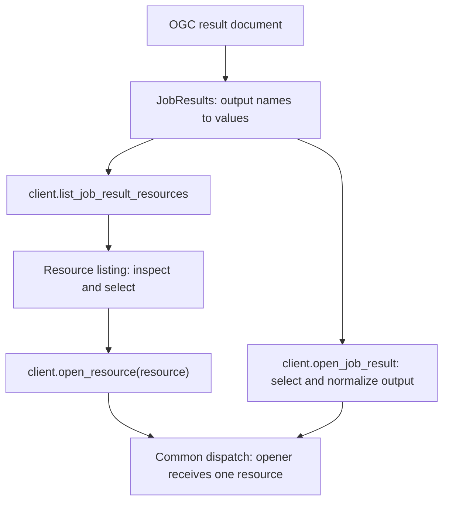

# Job Result Resources and STAC Discovery

Status: proposed design; the new interfaces and commands below are not implemented.

STAC type names (Item, ItemCollection, Collection, Catalog, and Asset) are
capitalized in prose, while code identifiers and JSON keys retain their
specified spelling.

This specification defines how Cuiman discovers and opens resources from any
OGC API - Processes job output value. STAC Items and related containers are one
resolver specialization, alongside ordinary links and arbitrary inline or
qualified values. It applies across processing services and application domains.
The description of the existing architecture is based on the Eozilla checkout
at `d72c016`. Requirements expressed as “must” or “should” below describe the
proposed Cuiman behavior, unless explicitly attributed to an external standard.

The public workflow is **list → inspect/select → open**:

```python
resources = client.list_job_result_resources(job_id, output_name="dataset")
resources  # displays a table in JupyterLab
resource = resources.select(item_id="ndvi-2026-09-01", key="data")
dataset = client.open_resource(resource, chunks="auto")
```

Keep `client.open_job_result(job_id, output_name=...)` as the convenience for
opening a job output directly. Both opening methods dispatch through one
resource-based opener contract. Replace the old opener implementations and
context contract; backward compatibility for custom openers is not required in
this 0.x redesign. Ordinary callers need only a resource listing and a resource,
without constructing resolvers, registries, contexts, or page objects.

## 1. Problem and requirements

Processes can produce STAC Items as job outputs, either directly or through
links to Items, ItemCollections, or other STAC containers. The Items describe
Assets held in object storage or other locations. Cuiman has pluggable
`JobResultOpener` implementations, but needs a discovery step to answer
**what is available to open?** before choosing how to open it.

For example, an agricultural monitoring application such as Sen4CAP may consume
STAC Items describing derived vegetation products. The same workflow applies
to any process producing STAC-described results.

The design questions and proposed answers are:

| Question or requirement | Proposed approach |
| --- | --- |
| Which OGC model should represent output references? | Use the standard OGC `Link`, represented by `gavicore.models.Link`. |
| How should output names and values be structured? | Preserve the `JobResults` mapping; list derived resources with output ownership and ancestry. |
| Which output values can produce resources? | Every output value is eligible for resolver acceptance and may yield one or more resources, regardless of its representation or STAC semantics. |
| How can Python API, CLI, and GUI reuse this functionality? | Share the resource contract and discovery policy; keep rendering and runtime-specific opening separate. |
| How do users discover and open data? | The client lists resources; both opening entry points pass one selected resource to the same opener implementation. |
| How can Cuiman recognize STAC from other services? | Prefer process output schemas, then use media type hints and bounded structural inspection. |
| Which STAC hierarchy levels should services return? | Prefer Item or ItemCollection; support Collection and Catalog with explicit traversal limits. |
| Where should resource-specific opening and storage settings live? | Carry optional resource hints and access descriptions; apply caller overrides and obtain credentials at runtime. |

The design must retain ordinary links, inline values, and qualified values. It
must work without project-specific output names, URL patterns, or service IDs.
Discovery must not download Asset payloads or open datasets merely to list them.

### Required user operations: outputs, Items, Assets

The following three operations must be independently available through the
Python API, CLI, and GUI. They are inspection views, not a mandatory navigation
sequence: users can list Assets directly without first selecting an Item.

1. **R1 — List job outputs:** list every output name together with its original
   value, including `Link` objects. This step requires no STAC discovery.
2. **R2 — List Items of an output:** given a selected output whose value is a
   recognized STAC object, list the available Items. In particular, support a
   `Link` whose `href` points to an ItemCollection. A single Item output produces
   a one-Item listing. Collection and Catalog outputs follow the explicit,
   bounded traversal policy below. Keep Item identity and output ownership in
   the listing, and expose pagination or incomplete discovery.
3. **R3 — List Assets of an Item:** given a selected Item, list all its Assets,
   displaying each Asset's **title, role(s), data type, and opener availability**.
   Preserve the Asset key as its identifier and title fallback. Show missing
   roles or type as unspecified, and keep Assets without an opener visible.

For R3, “data type” means the Asset's advertised format/media type (for example,
GeoTIFF or `image/tiff`), with additional data-type metadata when available.
An opener's Python return type, such as `xarray.Dataset`, is separate information;
neither the file format nor a pixel/column type should be inferred from it.

**P1 — Optional preview:** users should also be able to preview an Asset when a
suitable preview action is available. This is a desirable enhancement; R1–R3 must
work independently of preview support. Preview availability and opener
availability are separate capabilities, described in section 7.

**R4 — Resource-specific opening and access:** support optional opener hints and
storage descriptions for a selected resource, while allowing callers to override
opening options. For example, a STAC Asset may identify a Zarr dataset in an AWS
S3 bucket that requires an access key and secret, together with settings needed
by `xarray.open_dataset()`. Callers should not have to repeat dataset and storage
knowledge already supplied by the producer. Credentials belong to the runtime
access context; they must not be added to serializable resource descriptions.
Section 7 defines the separation, precedence, and effective reader call.

**R5 — Unified resource discovery for every output value:** every value supported
by `JobResults`, including links, qualified values, inline objects, arrays,
scalars, and null values, must be eligible for resolver acceptance. A resolver
that accepts a value may produce one or more `JobResultResource` objects, with
or without links or descendants. Neither `Link` normalization nor STAC recognition
is a prerequisite for dispatch. Use the same discovery, selection, capability,
and opening interfaces for these resources. R2 and R3 are STAC-specific
convenience views over this general model, not restrictions on it.

Scope is discovery, selection, and integration with opening. Implementing a full
STAC browser, changing the processing service protocol, adding data readers, and
bulk downloading are outside this proposal.

## 2. Current repository architecture

The following existing concepts identify the integration points. This section
describes the implementation being replaced, not compatibility requirements
for the proposed opener and resource contracts.

| Existing component | Relevant behavior |
| --- | --- |
| `gavicore.models.JobResults` | A root model containing `dict[str, JobResult]` or `None`; `JobResult` includes `Link`, `QualifiedValue`, and `InlineValue`. |
| `gavicore.models.Link` | Carries `href`, optional `rel`, `type`, `title`, and `hreflang`; also supports the Eozilla `x-options` extension. |
| `OutputDescription.schema_` | Python attribute for the serialized `schema` field of a process output. |
| `Client` / `AsyncClient` | Provide synchronous/asynchronous `get_job_results()` and `open_job_result()`. |
| `JobResultOpenContext` | Contains job results, configuration, process description, output selection, desired data type, media type override, and opener options. |
| `JobResultOpener` | Supplies `is_usable()`, `accept_job_result(ctx)`, and `open_job_result(ctx)`. Acceptance is a candidate check, not a guarantee that opening will succeed. |
| `JobResultOpenerRegistry` / `ClientConfig` | Register built-ins and application extensions; configuration classes have isolated registries, with later registrations taking precedence. |
| CLI `get-job-results` | Retrieves and renders the result mapping using existing output renderers. |
| Eozilla App `Service` and result views | Fetch `JobResults`, render each output, and provide inspection/copy/link actions. The browser app is a separate nested checkout. |

`JobResultOpenContext.output_link` already normalizes link-like values, including
raw dictionaries in some deserialization paths. `output_media_type` currently
uses an explicit override or typed `Link`/`QualifiedValue` metadata. The new
discovery boundary should consistently normalize these cases before inspection.

The default registry registers GeoPandas, pandas, and xarray openers. An image
opener implementation also exists, but is not registered by default. Consequently,
a thumbnail, TIFF, or object-storage URL being discovered does not establish that
the current environment can open it.

Relevant repository sources:

- [Gavicore models](../../gavicore/src/gavicore/models.py)
- [Client convenience methods](../../cuiman/src/cuiman/api/client_mixin.py)
- [Asynchronous methods](../../cuiman/src/cuiman/api/async_client_mixin.py)
- [Opener context](../../cuiman/src/cuiman/api/opener/context.py)
- [Opener contract and dispatch](../../cuiman/src/cuiman/api/opener/opener.py)
- [Opener registry](../../cuiman/src/cuiman/api/opener/registry.py)
- [Customization](customization.md) and [API reference](api.md)
- [CLI implementation](../../cuiman/src/cuiman/cli/cli.py)
- [App service architecture](../eozilla-app/service-provider.md)

The current browser app, including launches from Python, is the GUI target.
The deprecated legacy Cuiman GUI is not the target of this proposal.

## 3. Preserve the OGC result contract

The OGC result-document representation maps output identifiers to inline or
referenced values. Preserve that mapping and use standard `Link` objects for
references. This specification addresses that representation; raw or multipart
responses remain the responsibility of the existing transport layer.
See [OGC API - Processes Part 1](https://docs.ogc.org/is/18-062r2/18-062r2.html)
and its [results schema](https://schemas.opengis.net/ogcapi/processes/part1/1.0/openapi/schemas/results.yaml).

For example, a result document can contain two independent outputs:

```json
{
  "result": {
    "href": "https://example.org/jobs/123/item.json",
    "type": "application/geo+json",
    "title": "Vegetation result"
  },
  "report": {
    "href": "https://example.org/jobs/123/report.pdf",
    "type": "application/pdf",
    "title": "Processing report"
  }
}
```

`result` remains a link-valued process output after discovery. The STAC Item and
its Assets are a derived view associated with that output. Do not replace the
original value, promote Asset keys into the top-level mapping, or combine
unrelated process outputs into a synthetic STAC Collection.

No `StacResultLink`, new mandatory link relation, or proprietary media type is
required. `type` describes the linked representation. Existing standard link
fields retain their meaning. Eozilla extensions such as `x-options` are optional
integration details and must not be required for STAC recognition.

A direct link to a TIFF, PDF, or other file remains a valid ordinary output. It
does not become a standalone STAC Asset merely by having an `href` and `type`.

## 4. Recommended STAC output policy

| Representation behind an output link | Producer recommendation | Default Cuiman discovery |
| --- | --- | --- |
| **Item** | Primary representation for one logical result with related files. | Read the Item and enumerate its `assets`. Do not traverse its parent or Collection automatically. |
| **ItemCollection** | Preferred for multiple result Items, for example multiple dates or tiles. | Inspect embedded Items and their Assets within configured limits. Expose continuation when paginated or truncated. |
| **Collection** | Supported when the process creates or publishes a dataset. | Show dataset metadata and traversal actions; enumerate member Items only on explicit traversal. |
| **Catalog** | Supported primarily for interoperability with external services. | Show the container and navigation links; do not crawl descendants automatically. |
| **Asset object** | Not a standalone STAC output entity. | Discover Assets beneath their owning Item and retain that ownership. Ordinary direct file links remain supported. |

An Item groups the files describing one result. An ItemCollection contains Items
as a GeoJSON `FeatureCollection`; it is distinct from a Collection describing a
dataset. These distinctions follow the [Item specification](https://github.com/radiantearth/stac-spec/blob/v1.1.0/item-spec/item-spec.md),
[ItemCollection fragment](https://github.com/radiantearth/stac-api-spec/blob/v1.0.0/fragments/itemcollection/README.md),
[Collection specification](https://github.com/radiantearth/stac-spec/blob/v1.1.0/collection-spec/collection-spec.md),
and [Catalog specification](https://github.com/radiantearth/stac-spec/blob/v1.1.0/catalog-spec/catalog-spec.md).
The traversal defaults above are Cuiman policy.

STAC also permits Collection-level `assets`. Preserve them as Assets owned by
the Collection when present, without traversing member Items. The recommendation
to use Items for individual process results does not prohibit this standard
feature. Collection `item_assets` entries describe Assets that may occur in Items; they are not
concrete downloadable Assets and must not be offered as such.

### Example: one logical result

An illustrative document at `https://example.org/jobs/123/item.json`:

```json
{
  "type": "Feature",
  "stac_version": "1.1.0",
  "id": "ndvi-2026-09-01",
  "geometry": null,
  "properties": {"datetime": "2026-09-01T00:00:00Z"},
  "links": [
    {
      "rel": "self",
      "href": "https://example.org/jobs/123/item.json",
      "type": "application/geo+json"
    }
  ],
  "assets": {
    "data": {
      "href": "https://storage.example.org/jobs/123/ndvi.tif",
      "type": "image/tiff; application=geotiff; profile=cloud-optimized",
      "title": "NDVI raster",
      "roles": ["data"]
    },
    "thumbnail": {
      "href": "preview.png",
      "type": "image/png",
      "title": "Preview",
      "roles": ["thumbnail"]
    }
  }
}
```

The relative thumbnail URL resolves against the containing document's base URI,
giving `https://example.org/jobs/123/preview.png`. The original Asset description
and resolved access link should both remain available. Asset roles and metadata
follow the [STAC Asset specification](https://github.com/radiantearth/stac-spec/blob/v1.1.0/commons/assets.md).

The discovery view is:

```text
JobResults
  result -> original Link
    STAC Item ndvi-2026-09-01
      data       [data]       image/tiff; ...
      thumbnail  [thumbnail]  image/png
  report -> original Link   application/pdf
```

For several Items, the linked document uses `type: "FeatureCollection"` and a
`features` array containing the full Item objects. The hierarchy gains an
ItemCollection node, then one node per Item. Repeated Asset keys such as `data`
remain distinct because selection includes their owning Item and output.

## 5. Architecture: transport, discovery, selection, opening



Discovery belongs in Cuiman. Gavicore continues to own the OGC transport models.
The client hides STAC parsing, bounded metadata loading, adapter selection, and
opening dispatch. Discovery and reading remain separate extension seams: knowing
how to enumerate STAC Assets and knowing how to open GeoTIFF are independent
capabilities. Neither seam requires ordinary callers to learn adapter classes.

### 5.1 Two public result types

Expose `JobResultResourceListing` and `JobResultResource` through `cuiman.api`.
The listing is an iterable, indexable collection of resources, with selection,
display, and completeness information. There is no separate public page type,
no per-output page hierarchy, and no capability mapping that callers must join
back onto resources. Callers do not construct these types for ordinary use.

The following resource fields form a conceptual data contract, not a final
constructor signature:

| Field | Meaning |
| --- | --- |
| `id` | Opaque selector unique within the job's discovery view; independent of temporary signed URLs. |
| `output_name` | Original process output name; required on every resource. |
| `parent_id`, `path`, `item_id` | Ownership and human-readable ancestry; `item_id` is the source STAC Item identifier when applicable, not a globally unique selector. |
| `kind` | Extensible semantic kind, initially `value`, `link`, `stac-item`, `stac-item-collection`, `stac-collection`, `stac-catalog`, or `asset`. |
| `key` | Local source key, such as an Asset key or Item identifier, when available. |
| `link` | Optional normalized `gavicore.models.Link`; absent for embedded or inline resources without their own URL. |
| `value` | Optional JSON-compatible selected inline or qualified value for a resource without a link; distinguish an absent value from a present null value. |
| `media_type` | Effective representation type; retain media type parameters and record inference/overrides. |
| `title`, `description`, `roles` | Display and selection metadata; roles are a list, not a single classification. |
| `metadata` | JSON-compatible source metadata, including STAC IDs, version, extensions, and ownership information. |
| `provenance` | Source job/service identity and original output context; distinct from the selected resource's value and format. |
| `open_hints` | Optional JSON-compatible hints scoped to registered opener identifiers; suggest candidates and defaults without forcing opener selection. |
| `access` | Optional non-secret storage characteristics and authentication requirements, interpreted by runtime access/provider adapters. |
| `capabilities` | Runtime assessment of opener and preview availability, candidate identifiers/display names, and reasons. |
| `discovery_state` | `unresolved`, `partial`, `complete`, or `error` for semantic expansion; container state is independent of whether an opener accepts the container itself. |
| `diagnostics` | Per-resource detection, access, validation, or traversal messages. |

`open_hints` and `access` are conceptual names, not final API signatures. Keep
portable dataset facts in metadata and storage descriptions in `access`; an
opener translates these into its own arguments. Record the source of normalized
hints so callers can distinguish advertised settings from inferred defaults.
Runtime credentials and credential-provider objects must remain outside this
serializable contract. Discovery must work when these optional fields are absent
or their opener/storage adapter is unavailable.

Access capabilities through `resource.capabilities`. They are computed for the
current runtime, configuration, and requested return type, not copied from STAC
metadata. Internally they may be cached separately from discovery metadata and
refreshed independently. Serialized assessments identify their runtime and scope;
they are snapshots, not a promise that another runtime can open the resource.

The listing owns `discovery_state`, optional opaque `continuation`, and
`diagnostics`. An `output_states` mapping records discovery state and diagnostics
for every requested output, including outputs with zero rows or failed discovery;
it contains no nested resource pages. Preserve the original `JobResults`
separately. One output can yield multiple resources without an artificial
container. An empty completed listing is distinct from unresolved or failed
discovery. Successful sibling resources remain visible on partial failure.

The default view lists Assets of recognized Items and ItemCollections directly,
ordinary links, and inline resources. It includes unsupported resources. Item
and ItemCollection containers remain independently inspectable using the same
listing method's views, but are not extra rows in the default Asset-oriented
view. Collections and Catalogs remain visible as containers requiring explicit
member traversal; concrete Collection-level Assets are also listed. An empty
Item remains inspectable even when the default view has no Asset rows.

`select(**criteria)` searches the currently loaded rows and returns exactly one
match, or raises a no-match or ambiguity error. Criteria include `id`,
`output_name`, `item_id`, and `key`. It performs no network requests and does not
claim uniqueness across unloaded pages. Scripts requiring an exact resource
should use its opaque ID. Indexing, iteration, and length likewise apply only to
loaded rows. A continuation request returns another listing of the same type;
iteration never silently fetches all pages.

Resource identity must preserve output and ancestry, including Collection identity
where needed. Asset keys alone and Item IDs alone are insufficient. Expose an
opaque selector and a human-readable path; the final escaping and collision
scheme is an implementation decision. Refreshed signed links must not invalidate
otherwise unchanged selectors.

Ancestry describes a view over a potentially cyclic graph. Preserve relevant
navigation links as metadata or deferred actions rather than embedding a
recursive public object tree. Resource descriptions must carry enough ancestry
to identify owners even when their containers are absent from the current view.
Fetching the same document can be deduplicated while preserving its appearance
under multiple outputs.

### 5.2 Discovery implementation and extensions

Resolvers are discovery adapters behind the client. Built-in STAC discovery
requires no caller registration or construction of a STAC-specific resolver.
An extension author supplies an adapter through client configuration; registry
objects, document-loading contexts, and internal page bookkeeping are not part
of the ordinary user workflow. This specification does not prescribe extra
public resolver/context/page classes.

Internally, adapters receive the original value, including qualified wrappers,
output/schema provenance, base URI, and access to bounded metadata loading.
The client manages cached documents, sessions, cancellation, and request budgets.
Every output value is eligible for adapter acceptance without a Link or STAC
prerequisite. Explicit descendant expansion uses the same machinery while
preserving the selected resource's value and output ownership.

Contract requirements:

1. Use cheap value/schema/media inspection first. Inspect already available
   inline values directly. When structural inspection requires a referenced
   document, fetch through the shared bounded document loader and reuse that
   response during resolution and other candidates' inspection. Do not fetch
   once per resolver.
2. Resolve metadata only. Asset payloads belong to open/download actions.
3. Use deterministic precedence: configured specialized resolvers before the
   generic fallback. One selected resolver owns the supplied value's semantic
   expansion and may return multiple resources; multiple roots do not require
   combining results from several accepting resolvers.
4. Distinguish “not recognized” from “recognized but inaccessible/invalid.” Keep
   the original output visible and attach errors; one failure must not hide
   successful sibling resources.
5. Support cancellation, pagination, depth/Item/request/response-size limits,
   cycle detection, and explicit partial results.

A built-in STAC adapter handles the four supported container kinds.
Separate per-kind implementations are optional internal structure. A generic
fallback accepts any otherwise unhandled output value and exposes one link or
value resource without claiming STAC semantics. It preserves null, scalar,
array, and object values rather than treating them as absent or recursively
splitting them without a resolver-defined interpretation.

For example, a custom resolver can accept a non-STAC inline object containing
two named tables and return two sibling `value` resources, each with its table
value and selector. Another resolver can accept a `QualifiedValue` and describe
resources using its media type and embedded value. Both follow exactly the same
resource contract and dispatch path as resources discovered from a STAC link.

Client configuration should accept discovery and opener extensions without
requiring users to manage registries. Preserve configuration-class isolation,
deterministic precedence, and application overrides; do not mutate global
defaults when importing an application-specific client. The extension-author
contracts and configuration spelling remain to be finalized independently of
the small listing/opening interface.

## 6. STAC detection and traversal

### 6.1 Process output schema first

Inspect `process_description.outputs[output_name].schema_` when available. Known
STAC schema references or an unambiguous schema composition can select the STAC
resolver before downloading the result. For example, a process description
fragment can advertise the logical Item value:

```json
{
  "outputs": {
    "result": {
      "title": "Vegetation result",
      "schema": {
        "$ref": "https://schemas.stacspec.org/v1.1.0/item-spec/json-schema/item.json"
      }
    }
  }
}
```

This describes the output's content, which may be transmitted by reference. It
does not require the result document's `Link` wrapper to validate as a STAC Item.
A schema describing only a generic `Link` provides no STAC target-type evidence.
OGC output schema requirements are described in
[Part 1, process description](https://docs.ogc.org/is/18-062r2/18-062r2.html#_ogc_process_description).

Inspect recognized references without fetching arbitrary schema graphs. Local
references and compositions need bounded resolution. A union that allows both
STAC and another representation is only a candidate signal; inspect the actual
output. A schema hint is not proof that the returned document conforms.

`gavicore.models.Schema` models OpenAPI 3.0, while STAC schemas use JSON Schema.
Preserve reference identifiers and extension keywords; full STAC validation needs
a validator supporting the advertised schema dialect. Do not infer full schema
validation support from Gavicore's model acceptance.

### 6.2 Media type and structural fallback

If schema evidence is absent or insufficient:

- Treat `application/geo+json`, `application/json`, and appropriate `+json`
  representations as candidates. Normalize the base media type while retaining
  its parameters. Inspect link metadata and the fetched response Content-Type.
- Media type alone must never classify a document as STAC. Ordinary GeoJSON has
  the same media type as a STAC Item.
- Recognize an Item from `type: "Feature"`, a string `stac_version` and `id`,
  object `properties` and `assets`, array `links`, and the required geometry
  member. These are recognition checks; full validation remains distinct.
- Recognize ItemCollections from `type: "FeatureCollection"` and a `features`
  array of recognized STAC Items. Do not require a top-level `stac_version`.
  An empty FeatureCollection needs schema or other explicit STAC context;
  otherwise report ambiguity. Mixed STAC/non-STAC members are diagnostic cases,
  not evidence that the entire collection conforms.
- Recognize Collection/Catalog using their distinct `type`, `stac_version`, and
  required core structure; Collection recognition additionally checks dataset
  fields such as `extent` and `license`.
- For missing or incorrect media types, allow a bounded JSON probe when schema
  evidence or an explicit user/provider hint warrants it. Do not probe arbitrary
  binary outputs automatically. Output names and `.json` suffixes are only hints.

Record detection evidence and warnings. Unsupported versions or extensions
should preserve inspectable core metadata where possible and clearly state
limits. If a schema declares STAC but the document is unrelated JSON, report the
mismatch and keep the original link; never fabricate Assets.

### 6.3 Bounded expansion

For Items, enumerate embedded Asset metadata only. For ItemCollections, enumerate
embedded Items within limits; retain a continuation for remaining members or
advertised next pages. Default listing must not silently fetch every page.
Pagination adapters must respect advertised request semantics and stop on
repeated continuations.

Collections require an explicit request to list members, using advertised static
`item` links or supported API `items` endpoints. Catalogs expose explicit
navigation through relevant `child`/`item` links. Do not invent endpoint paths or
follow every link relation. No automatic traversal of `root`, `parent`, or
`collection` links, and no automatic deep crawling from a Catalog result.

Bounded expansion must return `partial` plus the reason when limits are reached.
A successfully resolved empty ItemCollection is `complete` with zero members;
an inaccessible Collection is not an empty dataset.

## 7. Two opening entry points, one opener contract

The selected resource supplies its own value or resolved URL, media type,
optional opener hints, and access description. Runtime access adapters supply
scoped credentials where needed. The original output remains available as
provenance; for a STAC Asset this includes its source container.

Expose two client entry points:

```python
client.open_job_result(job_id, output_name="dataset", data_type=None, **options)
client.open_resource(resource, data_type=None, **options)
```

`open_job_result()` keeps the convenient job/output selection and existing
polling behavior. It normalizes the selected original output into one resource
and uses common opener dispatch. A plain link or inline value does not require
STAC discovery first. Opening a STAC output this way means opening the selected
output itself, subject to an accepting opener; it does not implicitly select a
descendant Asset. Ambiguous output selection must produce a clear error rather
than choosing the first output.

`open_resource()` receives an explicitly selected resource, including a linkless
value. It does not rediscover the output, select a different resource, or poll
the job. Access adapters may refresh an expired location while preserving the
resource identity. Both methods support the requested return type, media type
override, and caller options, and dispatch to the same opener implementation.

Replace the old opener contract with a resource-based contract. Conceptually:

```python
class JobResultOpener:
    async def accept(self, resource: JobResultResource, *, runtime) -> bool:
        """Check for a candidate without reading data payloads."""

    async def open(self, resource: JobResultResource, *, runtime):
        """Open the selected resource with effective runtime settings."""
```

`runtime` is a placeholder for client-supplied opening settings and services;
its exact argument shape remains an implementation decision. It conveys the
requested return type, effective media type, candidate-specific options, and
scoped access services. Acceptance must not acquire Asset credentials; access
services resolve those only when opening. Ordinary callers neither construct
this runtime argument nor manage opener dispatch.

An opener implements one acceptance method and one opening method. It does not
need separate methods for job outputs and discovered resources. Rewrite built-in
and custom openers to this contract; no compatibility adapter, optional
resource-aware mode, or preservation of `JobResultOpenContext` is required.

The resource is authoritative for its selected link/value, media type, roles,
and metadata. Original job results, output identity, and process output schema
are provenance; they must not substitute for the selected resource's value or
schema. An Asset must not inherit its container's GeoJSON media type. An explicit
media type override applies to opening without mutating the resource description.
Options and runtime access remain separate from the serializable resource.

Report candidate openers through each selected resource's capabilities.
Discovery lists resources even if no usable opener accepts them. Candidate
checks must not open payloads, and the UI must distinguish a potential action
from successful access.
Preserve dispatch precedence and opening errors, including optional dependencies,
unsupported formats, and storage authentication failures.

### Resource hints, storage settings, and runtime credentials

Separate producer knowledge from runtime access and consumer preferences:

| Information | Recommended home |
| --- | --- |
| Dataset facts, such as Zarr format, group, and consolidated metadata | Resource metadata, translated by the selected opener. |
| Opener-specific defaults that cannot be expressed portably | Optional `open_hints`, scoped to a registered opener identifier. |
| Storage provider, region, endpoint, and authentication requirements | Resource `access` description. |
| Access key, secret, and session token | Runtime credentials from client configuration, an access provider, or explicit caller options. |
| Consumer preferences, such as chunking, decoding, and variables to drop | Caller options, optionally with resource-specific defaults. |

Generic discovery must remain independent of xarray or any other reader library.
An opener adapter translates recognized dataset/storage metadata and its own
hints into reader arguments. A hint may recommend an installed opener but must
not load arbitrary code, force selection, or bypass the requested return type.
Options for one opener must not leak into another candidate's runtime settings.

For non-secret options, apply the following precedence, lowest to highest:

1. Opener defaults.
2. Accepted resource hints, including defaults derived from resource metadata.
3. Client-configured overrides for the selected resource/opener.
4. Explicit call options.

Merge only mappings declared mergeable by the opener's option schema, such as
`backend_kwargs` and non-secret `storage_options`; higher-precedence values
replace the same keys. Scalars and lists are replaced, not concatenated.
Overriding `chunks` must not discard unrelated storage settings. An opener must
document how callers clear inherited settings. Preserve the original hints and
caller inputs; compute effective options separately for each candidate. Expose
non-secret effective settings and their provenance for inspection.

Credentials are resolved separately for the selected storage target. An explicit
caller credential set takes precedence over a configured provider; replace the
whole set atomically, including any session token, rather than combining keys
from different identities. Otherwise the access adapter uses configured or
ambient credentials within their authorized scope. Never serialize resolved
credentials into resource listings, logs, diagnostics, or browser resource
descriptions. Resolving metadata or assessing candidate openers must not require
acquiring Asset credentials or testing Asset access.

Remote hints and `x-options` require opener-specific validation before use; they
must not be forwarded wholesale as reader keyword arguments. Unrecognized or
unsupported hints remain inspectable with diagnostics. Storage endpoints from
metadata must respect the scope of locally selected credentials; metadata cannot
authorize forwarding credentials to another host. Do not inherit a STAC
container's access settings automatically for its Assets.

#### Example: authenticated Zarr on AWS S3

Suppose the selected Asset has an `s3://` URL, advertises Zarr with consolidated
metadata, and describes the relevant S3 storage and authentication requirements.
The caller requests `chunks="auto"`. An access adapter supplies
`runtime_storage_options` containing the accepted non-secret storage settings
and the access key/secret (and session token, when needed) obtained at runtime.
After validation and option resolution, the effective reader call is:

```python
xr.open_dataset(
    asset_href,
    engine="zarr",                 # derived from resource format
    chunks="auto",                 # caller preference
    backend_kwargs={
        "consolidated": True,      # resource hint
        "storage_options": runtime_storage_options,
    },
)
```

This illustrates the resulting call, not code executed during discovery or a
new public Cuiman signature. The xarray adapter handles the placement of storage
settings under `backend_kwargs`, following the
[xarray cloud-storage documentation](https://docs.xarray.dev/en/stable/io.html#cloud-storage-buckets).
Missing credentials leave the Asset discoverable and its candidate opener
visible; opening reports an actionable access failure.

#### STAC interoperability

Prefer portable STAC metadata and recognized extensions, including the
[Storage extension](https://github.com/stac-extensions/storage), as inputs to the
generic access description. Interpret extensions according to their advertised
versions; this proposal does not define a new mandatory STAC extension.

The [xarray Assets extension](https://github.com/stac-extensions/xarray-assets#deprecation-notice)
defined `xarray:open_kwargs` and `xarray:storage_options`, but is deprecated
because it was too specific to Python and xarray. Support those fields only as
an optional compatibility input through a validating adapter, rather than as
the foundation of the resource contract. Eozilla `x-options` likewise remains
an optional input with explicitly defined interpretation, not unrestricted
reader arguments or a credential-distribution mechanism.

### Opener availability in resource listings

The same assessment applies to all resource kinds, including linkless values.
R3 requires it for each listed Asset, not only after the user selects one to open.
Use environment/dependency checks and `accept(resource, ...)` to determine
candidate openers. Expose these states through `resource.capabilities` in both
structured results and user-facing listings:

- **Available:** at least one usable registered opener accepts the Asset; include
  its display name and identifier so callers can inspect or choose candidates.
- **Unavailable:** the assessment completed and no usable opener accepts it.
  Include a reason where known, such as a missing optional dependency.
- **Unknown:** assessment is pending, failed, or cannot be performed in this
  runtime. Do not display this as “no opener.”

“Available” means a candidate opener exists, not that the Asset has been fetched
or successfully opened. Candidate assessment must not read Asset payloads.
Assessments should reuse metadata and be refreshable when configuration,
dependencies, credentials, or requested return types change. The GUI identifies
whether an action runs in the browser or its connected Python environment.

### Optional Asset previews

A preview action should show a supported representation of the selected Asset,
such as an image, map, or small table, without requiring users to choose a full
opening workflow. A browser renderer may provide preview even without a Python
opener; a Python opener may be available without any suitable preview renderer.
Report preview availability independently using available/unavailable/unknown
states and an action descriptor.

Request preview content only on a user preview action, with size/time limits,
loading/error feedback, and cancellation. Listing Assets must not automatically
download them to generate previews. A supplied thumbnail may be displayed as an
Item preview; do not imply it depicts a particular sibling Asset unless that
association is known. A preview failure leaves the Asset listing and its other
actions usable. Preview adapters and their initial supported formats remain an
implementation choice.

Do not choose the first Asset silently when several are present. Roles can help
sort or recommend a selection, but a `data` role does not imply uniqueness or
reader support. Opening a container itself remains a separate explicit choice
when an appropriate opener is installed.

## 8. Python API, CLI, and GUI behavior

### Python API

Add equivalent methods on `Client` and `AsyncClient`; the synchronous client
should wrap the same asynchronous discovery implementation, following existing
Cuiman conventions. The everyday synchronous workflow is:

```python
resources = client.list_job_result_resources(job_id, output_name="dataset")
resources  # renders a table in JupyterLab

resource = resources.select(item_id="ndvi-2026-09-01", key="data")
dataset = client.open_resource(resource, chunks="auto")
```

The listing supports iteration and positional access after inspection:

```python
for resource in resources:
    print(resource.title, resource.media_type, resource.capabilities)

# For a listing whose first row the user has explicitly chosen:
dataset = client.open_resource(resources[0])

# Direct opening remains available without listing resources first:
dataset = client.open_job_result(job_id, output_name="dataset")
```

These are alternative opening workflows: the direct call targets the original
output, while the selected-resource call targets that exact resource. A proposed
`resource.open()` convenience, if added, must delegate to the associated client's
`open_resource()` rather than introduce another opener contract. It is not
required for the initial interface. Any private client association is excluded
from serialization; portable descriptions never contain sessions or credentials.

Raw outputs and STAC-specific inspection remain available without introducing
separate Item/Asset method families. Proposed scoped views are:

```python
raw = client.get_job_results(job_id)  # R1: original values, no discovery

items = client.list_job_result_resources(
    job_id, output_name="dataset", kind="stac-item"
)  # R2: a single Item output yields one row
item = items.select(item_id="ndvi-2026-09-01")
assets = client.list_job_result_resources(
    job_id, parent_id=item.id, kind="asset"
)  # R3: Assets owned by exactly this Item

# Explicit expansion of a Collection or Catalog identified in a listing:
expanded = client.list_job_result_resources(
    job_id, parent_id=container_id
)

# Explicit continuation using the same scope and view as the first request:
if resources.continuation is not None:
    next_resources = client.list_job_result_resources(
        job_id, output_name="dataset", continuation=resources.continuation
    )
```

`kind` selects an inspection view; it does not authorize extra traversal.
`parent_id` explicitly requests the immediate members of that container within
the traversal policy and limits, with `kind` filtering those members when given.
This explicit member view includes Item containers rather than flattening them
into their Assets. Listing Items from a Collection or Catalog thus
requires selecting that container as `parent_id`. ItemCollection views inspect
embedded Items without following every next page. A non-STAC output requested
as an Item view reports an unsupported-kind diagnostic, distinguishable from an
empty recognized STAC container. All views return the same listing type.

Continuations are bound to the service/job, scope, view, and access context. The
client must reject mismatched or expired continuations explicitly. A listing's
state describes completion of the requested view, not whether a whole Catalog
has been crawled. Deferred containers retain their own expansion state. A
complete listing may contain unresolved containers; partial discovery and
failed outputs must remain visible through listing and output states.

The method also supports traversal limits, a requested return type for capability
assessment, and refresh. It works for non-STAC and linkless resources. Initial
listing requires successful job results and reports a clear status error for
unfinished/failed jobs; it does not implicitly wait. For `AsyncClient`, await
`list_job_result_resources()`, `open_job_result()`, and `open_resource()`.
Selection, iteration, and rendering remain local synchronous operations on the
returned snapshots.

### Notebook rendering

The listing provides a rich HTML representation for JupyterLab and a readable
plain-text fallback. The default table shows output name (when needed), owning
Item/path, key, title, roles, format/media type, and opener availability. Candidate
names and reasons must be inspectable through each resource. Show preview
availability separately when supported, and use the key as the title fallback.

Render empty, partial, failed, and deferred-discovery states explicitly, including
a notice when another page is available. Display and redisplay must use loaded
metadata only: no automatic pagination, metadata fetches, Asset downloads,
credential acquisition, or preview requests. Escape untrusted titles and other
metadata in HTML. Rendering must not require pandas or an optional data reader.

### CLI

Follow the repository's flat, hyphenated command names. Keep the current
`cuiman get-job-results JOB_ID` behavior. Proposed commands, not current CLI syntax:

```text
cuiman get-job-results JOB_ID
cuiman list-job-result-resources JOB_ID --output-name dataset
cuiman list-job-result-resources JOB_ID --output-name dataset --format json
cuiman list-job-result-resources JOB_ID --output-name dataset --kind stac-item
cuiman list-job-result-resources JOB_ID --parent-id ITEM_RESOURCE_ID --kind asset
cuiman list-job-result-resources JOB_ID --parent-id CONTAINER_RESOURCE_ID
cuiman list-job-result-resources JOB_ID --output-name dataset --continuation TOKEN
```

Use the same default view, scope, and continuation semantics as the Python
method. A normal listing shows title, roles, format, and opener availability,
including unsupported resources. For example (selectors abbreviated here):

```text
ID  ITEM / PATH      KEY        TITLE        ROLES      FORMAT   OPENER
r1  ndvi-2026-09-01   data       NDVI raster  data       GeoTIFF  Available: xarray
r2  ndvi-2026-09-01   thumbnail  Preview      thumbnail  PNG      Unavailable
```

Add output ownership when listing several outputs, and kind/state for container
views. Item and Asset inspection use this same command rather than separate
command families. Missing roles/type display as unspecified. Show continuation
and discovery diagnostics alongside the table, including for zero-row outputs.

JSON output must retain the complete media type, candidate opener identifiers,
assessment states/reasons, and source identity. A friendly format label must not
discard media type parameters. CLI preview, if provided, can launch a supported
viewer; listing and opener assessment must work without a graphical environment.

Make full, copyable opaque selectors available in normal output (a details block
may avoid overly wide tables) as well as JSON. JSON serialization contains rows,
scope, output states, continuation, and diagnostics without runtime objects or
credentials. Scripts receive structured errors rather than selection prompts.
A CLI open action remains a separate design question: it needs a defined export
destination or viewer, since returning a Python object has no CLI presentation.
The listing command does not depend on settling that action.

### GUI / Eozilla App

Keep output-name groups and existing raw-output inspection/copy actions. Add
lazy resource trees showing all discovered resources, including Items and Assets,
with titles, roles, types, and available actions. Collection and Catalog rows
offer explicit expansion; partial
results show “Load more.” Distinguish loading, empty, failed, and unsupported
states. A discovery failure must not remove the original output link.

Display multiple resource roots under their owning output group, and allow
selection and capability inspection for inline and non-STAC resources without
requiring a URL. The generic CLI commands and GUI must use the same resource
selectors and discovery states as the Python API.

For STAC outputs, job outputs, Items, and Assets must each remain independently
inspectable. A direct Asset listing retaining ownership is the ordinary route;
users need not pass through an Item selection screen first. An Item view and
scoped Asset view satisfy R2/R3 using the same resources. A tree may be built
from ancestry and explicit expansion without exposing a recursive Python model.

The Item's Asset list must show title (falling back to Asset key), all roles,
data type, and opener availability on each row. Allow inspection of candidate
openers and reasons for unavailable/unknown status. Provide a separate Preview
action when supported, with the bounded behavior in section 7. Preview failure
or absence must not hide an Asset or block other available actions.

The app's `Service` boundary should expose the same serializable resource
contract. In a Python-launched app, a proposed local discovery/action adapter can
reuse the Python client's discovery and opening dispatch. The current
processing-service proxy does not itself supply this discovery API.

A standalone browser app cannot execute Python opener classes. It needs either
an advertised companion discovery service or browser resolver/action adapters
with equivalent contracts and traversal policy. Share fixtures and acceptance
cases across implementations. Browser actions can include supported preview,
download, or opening a link; Python-backed actions need an explicit result
presentation/export contract. Do not promise every Python opener in every GUI.

## 9. Interoperability and access

- **Service independence:** no project-specific IDs, output names, Asset keys, or
  hostnames in generic detection. Provider overrides remain optional plugins.
- **Representation preservation:** retain inline/qualified outputs and generic
  links. Embedded STAC JSON can use the same structural resolver without a
  download; relative links require a known base URI.
- **URLs:** resolve relative references using the effective containing-document
  base, including redirects and appropriate self-link context for embedded
  Items. Report an unresolved base instead of guessing. Preserve signed query
  parameters exactly; do not use signed URLs as resource identity.
- **Authentication:** processing API, STAC host, and Asset store may have different
  credentials. Reuse configured sessions only within their authorized scope;
  do not forward processing tokens to arbitrary linked hosts or redirects.
  Credential acquisition and URL renewal belong to access/provider adapters.
  Resource `access` describes requirements; resolved secrets stay in the runtime
  context, following the option and credential policy in section 7.
- **Storage:** HTTPS links, signed links, and schemes such as `s3://` are resource
  locations; opening depends on installed readers and configured storage access.
  Missing access leaves an inspectable resource and an actionable diagnostic.
- **Browser constraints:** CORS, download behavior, and storage access can differ
  from Python. The existing API proxy must not be assumed to proxy arbitrary
  STAC or Asset hosts; any companion adapter needs scoped URL handling.
- **Caching:** share fetched metadata within a discovery operation and support
  refresh. Cache by resource and access context, honor expiry/HTTP validators
  where available, and avoid exposing credentials or signed URLs in diagnostics.
- **Payloads and options:** list from metadata without Asset probes. Do not treat
  untrusted STAC extension fields or remote `x-options` as executable instructions
  or unrestricted local reader options.

## 10. Acceptance criteria for implementation

These are future verification scenarios; this document introduces no code changes.

1. A mapping containing an Item link, PDF link, and inline value retains every
   original output and exposes the Item's Assets under its own output only.
2. A plain GeoJSON Feature is not classified as STAC. Missing-schema STAC Items
   are recognized structurally; misleading schema hints produce diagnostics.
3. ItemCollections expose multiple Items, including duplicate Asset keys under
   different Items. Empty, mixed, paginated, and limit-truncated cases are explicit.
4. Collection/Catalog listing does not fetch member documents until requested;
   bounded explicit expansion terminates even with cycles or repeated pages.
5. Both `open_job_result()` and `open_resource()` pass one resource to the same
   opener contract. The former normalizes the selected original output; the
   latter opens exactly the supplied resource. Choosing an Asset supplies its
   own value/media type with original job/output context retained as provenance.
   Neither route silently selects the first Asset, and an Asset never inherits
   its container's media type or schema. Rewritten openers need no legacy context
   or separate job-output opening method.
6. Unsupported Assets remain listed. Discovery succeeds without optional opener
   dependencies or Asset payload downloads; opening failures remain separate.
7. Relative URLs, expired signed URLs, separate storage credentials, and a failed
   sibling resource yield predictable results without hiding available siblings.
8. Python, CLI JSON, and GUI adapters represent the same output hierarchy,
   selections, completeness, and errors. Resolver configuration is isolated per
   application configuration class.
9. **R1–R2:** users can list output names and original values without
   dereferencing STAC links, inspect an ItemCollection output's Items, and select
   an Item independently. They can also list its Assets directly without first
   listing Items. An Item view of a direct Item output yields one Item, including
   when it has no Assets. Non-STAC outputs, empty recognized containers, and
   partial listings are distinguishable.
10. **R3:** each selected Item's Asset listing shows title/key fallback, all roles,
    advertised data type or unspecified, and available/unavailable/unknown opener
    status. Candidate names and assessment reasons are accessible. An accepting
    opener, no usable opener, and a failed assessment produce distinct states
    without fetching Asset payloads.
11. **P1, when implemented:** a supported Asset can be previewed on request;
    listing alone fetches no preview payload. Preview availability is independent
    of opener availability. Missing or failed preview support leaves R1–R3 and
    other Asset actions functional.
12. **R4:** an S3 Zarr Asset's validated format/storage metadata and opener hints
    combine with runtime credentials and caller options to produce the effective
    xarray call in section 7. No Asset credentials are acquired and no Asset
    payload is fetched during listing or candidate assessment.
13. Option resolution follows opener defaults, resource hints, client overrides,
    and explicit call options in that order. Nested overrides retain unrelated
    settings; credential replacement is atomic; candidate settings and original
    inputs remain independent. Effective non-secret settings are inspectable.
14. Unsupported or invalid remote hints produce diagnostics without being
    forwarded as arbitrary reader arguments. An endpoint outside credential
    scope receives no credentials. Missing access does not hide an Asset, and
    resolved secrets never enter serialized listings or diagnostics.
15. **R5:** registered resolvers receive link, qualified, and inline output values
    without a Link/STAC prerequisite. A non-STAC inline object containing two
    tables produces two selectable sibling resources from one accepting resolver.
    Both retain their output ownership and open their selected values through
    `open_resource()` with no fabricated URL or STAC container.
16. Unhandled scalar, null, array, and object values produce one generic value
    resource each. A present null value remains distinct from an absent value.
    Single-resource, multiple-resource, empty-complete, partial, and failed
    listings share the same type and preserve the original output mapping.
17. Python, CLI, and GUI expose non-STAC and linkless resources through the same
    discovery, selection, capability, and opening contracts used for STAC-derived
    resources. STAC Item/Asset views use the same listing method and CLI command.
18. `list_job_result_resources(job_id, output_name="dataset")` returns an
    iterable, indexable listing. Resources expose their own capabilities. No
    resolver, registry, context, nested per-output page, or capability-map join
    is needed in the ordinary list/select/open workflow.
19. `select()` returns exactly one matching loaded row or reports no match or
    ambiguity. Duplicate Asset keys and repeated Item IDs in different ancestry
    remain distinguishable through opaque IDs. Selection, indexing, iteration,
    and length never fetch additional pages or claim completeness of unloaded
    results. Mismatched/expired continuations produce explicit errors.
20. JupyterLab HTML and plain-text representations show ownership, key/title,
    roles, format, and opener availability, including unsupported resources.
    Rendering escapes untrusted metadata, needs no optional reader library, and
    performs no network, credential, or payload access. Empty, failed, partial,
    and deferred states remain distinguishable, including on redisplay.
21. The CLI `list-job-result-resources` command has matching default and scoped
    views, tables, selectors, and explicit continuation. JSON retains ancestry,
    capability assessments, full media types, output states, and diagnostics.
    Python runtime associations and credentials are excluded from serialization.
22. A default listing exposes Item/ItemCollection Assets directly, keeps
    Collection/Catalog containers visible without fetching members, and includes
    concrete Collection Assets. Item views and explicit parent expansion retain
    ownership. Completion of a view does not imply completion of deferred
    container traversal. Failed or empty outputs remain visible in output states
    alongside successful siblings.
23. Synchronous and asynchronous clients share discovery and opening behavior.
    Initial listing reports unfinished jobs without polling; `open_job_result()`
    retains polling; `open_resource()` opens the selected resource without
    polling or repeating discovery, except for any necessary location renewal.

## 11. Open design questions

- Final model representation: frozen dataclasses or Pydantic models for
  serialization? Agree selector encoding, schema versioning,
  immutable snapshots, and continuation lifetime before exposing a stable API.
- Finalize discovery extension contracts and simple client configuration of
  discovery/opening adapters, including multiple-match diagnostics and whether
  detection deserves a richer result than `bool`. Registry and internal page
  classes need not become public user concepts.
- Finalize the `open_hints` and `access` schemas, stable opener identifiers,
  supported option mappings, clearing inherited settings, and runtime access
  provider hooks. Choose initial STAC extension adapters and their supported
  versions; the separation and precedence in section 7 are agreed requirements.
- Finalize the client-supplied runtime arguments for opener `accept()` and
  `open()`, keeping selected resources authoritative and original output/schema
  information accessible as provenance. Existing custom openers will be
  rewritten; legacy context compatibility is not a requirement.
- Which STAC versions and extensions are supported initially? Should full schema
  validation be optional, and should parsing use PySTAC or a minimal parser?
- Agree concrete request, byte, Item, depth, and timeout defaults; pagination
  request-method support; cache lifetime; and refresh behavior for signed links.
- Which output schema references and representations should processing services
  advertise for interoperable discovery? How should a service identify per-job
  scope when a result Collection contains Items beyond this execution?
- Choose the first GUI integration path and its capability advertisement. Define
  how Python opener results are displayed/exported and which standalone browser
  actions are supported.
- Decide CLI opening destinations/viewers and strict/partial failure exit
  status. Listing is independently useful and must not depend on a CLI opening
  action. Implicit first-Asset selection is excluded.
- Finalize capability refresh controls, discovery-state aggregation on mixed
  output failures, and serialization spelling. Decide whether a client-associated
  `resource.open()` convenience adds value beyond `client.open_resource()` and
  define its session lifetime if provided. Choose initial preview renderers and
  whether CLI previews launch a browser or another application. R1–R3 remain
  required independently of optional previews.

The core decision is independent of these details: preserve the OGC output
mapping, expose a simple resource listing with ownership and bounded discovery,
and pass one resource to an opener. Two client opening entry points share that
single opener contract, without preserving the old implementation underneath.
