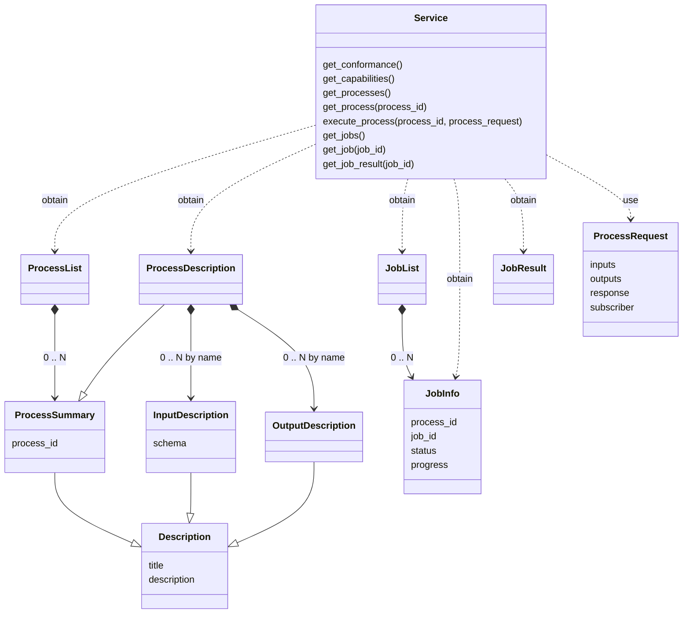

# `gavicore.service` Description

## Overview

This package defines the core interface [Service][gavicore.service.Service] 
which is an abstraction of the Wraptile server's backend implementation.

The following class diagram provides an overview of how 
[Service][gavicore.service.Service] relates to other model classes defined in 
Gavicore.

