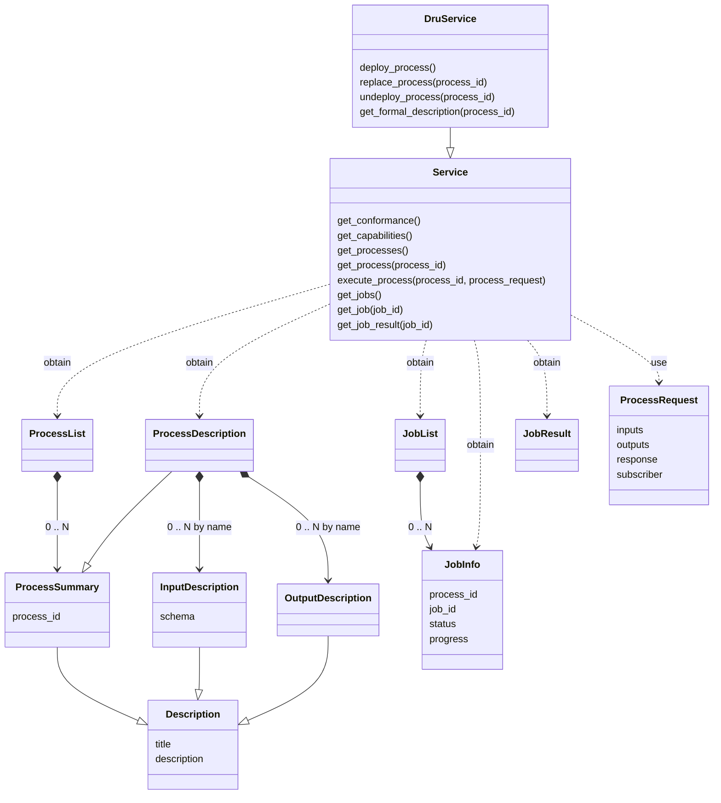

# `gavicore.service` Description


## Overview

This package defines two interfaces for the Wraptile server's backend
implementation:

- [`Service`][gavicore.service.core.Service] in `gavicore.service.core`
  defines OGC API - Processes Part 1: Core operations.
- [`DruService`][gavicore.service.dru.DruService] in `gavicore.service.dru`
  extends `Service` with Part 2: Deploy, Replace, Undeploy operations and
  application-package retrieval.

```python
from gavicore.service.core import Service
from gavicore.service.dru import DruService
```

Import service interfaces from the module that owns them.

In addition, it provides a utility module [`errors`][gavicore.service.errors] 
which helps creating RFC7807-compliant error objects of type 
[`ApiError`][gavicore.models.core.ApiError]. Error helpers are shared across
Core, DRU, and Eozilla-specific operations.

The following class diagram provides an overview of how 
[`Service`][gavicore.service.core.Service] relates to other model classes defined in
Gavicore.



```mermaid
classDiagram
direction TB
    class Service {
        get_conformance()
        get_capabilities()
        get_processes()
        get_process(process_id)
        execute_process(process_id, process_request)
        get_jobs()
        get_job(job_id)
        get_job_result(job_id)
    }
    class ProcessList {
    }
    class DruService {
        deploy_process()
        replace_process(process_id)
        undeploy_process(process_id)
        get_formal_description(process_id)
    }
    DruService --|> Service
    class ProcessSummary {
        process_id
    }
    class ProcessDescription {
    }
    class ProcessRequest {
        inputs
        outputs
        response
        subscriber
    }
    class JobList {
    }
    class JobInfo {
        process_id
        job_id
        status
        progress
    }
    class JobResult {
    }
    class InputDescription {
        schema
    }
    class Description {
        title
        description
    }
    ProcessList *--> ProcessSummary : 0 .. N 
    ProcessSummary --|> Description
    ProcessDescription --|> ProcessSummary
    ProcessDescription *--> InputDescription : 0 .. N by name
    ProcessDescription *--> OutputDescription : 0 .. N by name
    InputDescription --|> Description
    OutputDescription --|> Description
    JobList *--> JobInfo : 0 .. N 
    Service ..> ProcessList : obtain
    Service ..> ProcessDescription : obtain
    Service ..> JobList : obtain
    Service ..> JobInfo : obtain
    Service ..> JobResult : obtain   
    Service ..> ProcessRequest : use      
```
