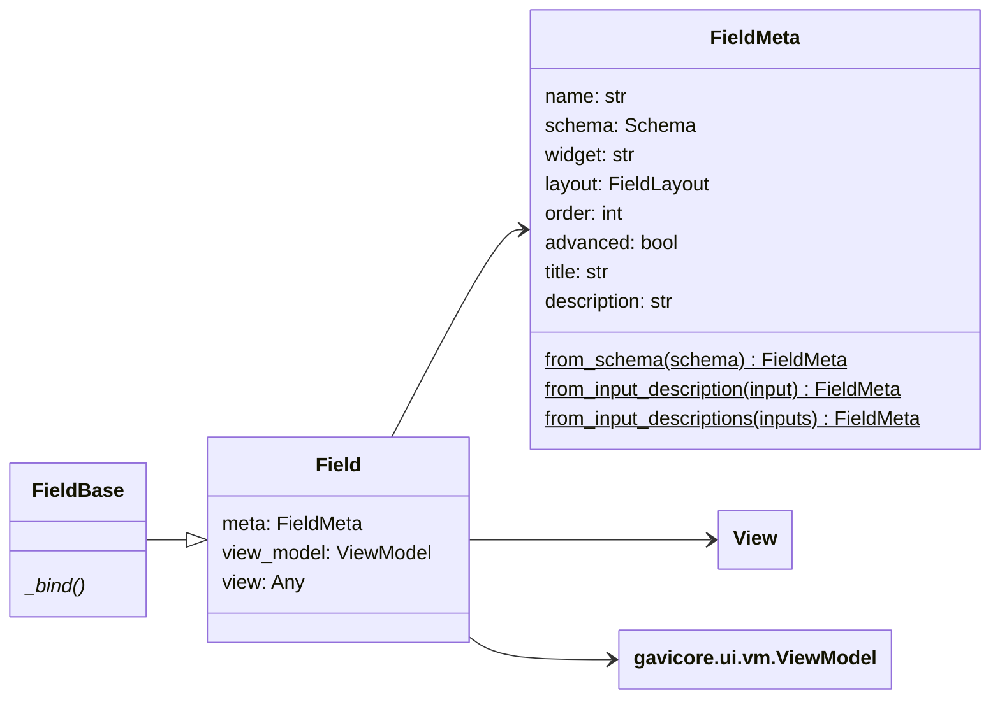
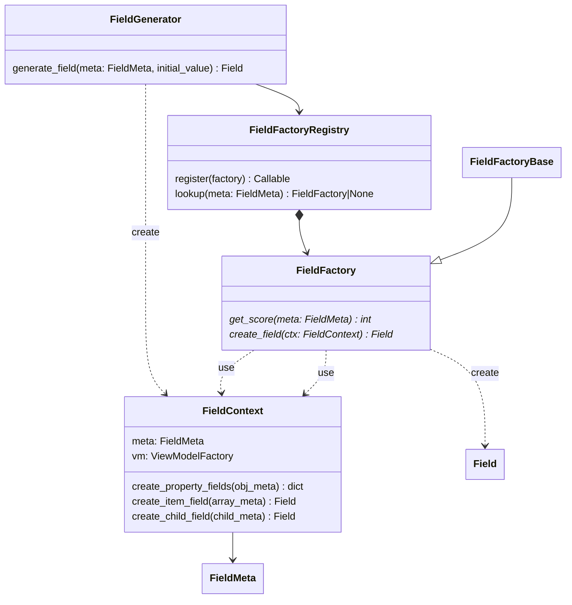
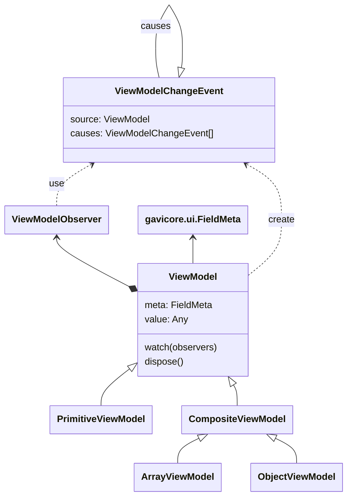
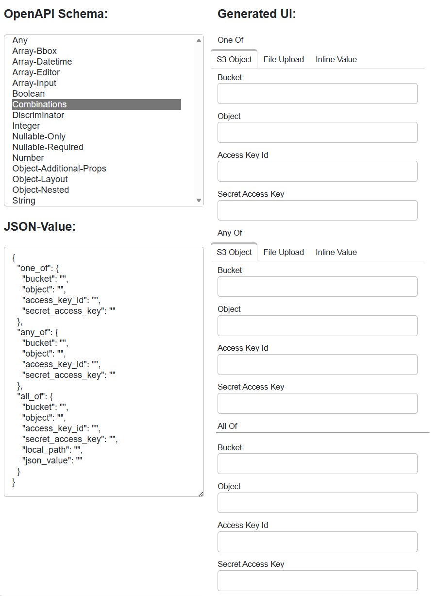

# `gavicore.ui` Description

The `gavicore.ui` package contains the code to generate widgets and panels 

- from plain OpenAPI Schema instances of type [Schema][gavicore.models.Schema], 
  and
- from input instances within a process, i.e., 
  [InputDescription][gavicore.models.InputDescription] instances contained 
  in a [ProcessDescription][gavicore.models.ProcessDescription] instance.

The design of the framework's core is neutral with respect to the target UI 
library. An implementation that generates UIs for the [Panel](https://panel.holoviz.org/) library
is located in the `gavicore.ui.panel` package. It is used by
the Cuiman `cuiman.gui.Client` to generate UIs for the 
OpenAPI schemas of the inputs of a selected process in Jupyter Notebooks.
The customization of the GUI generation in Cuiman is described
[here](../../cuiman/gui-generation.md).

## Programming Model

The framework entry point to generate UI from an OpenAPI schema is the
[FieldGenerator][gavicore.ui.FieldGenerator] class that is configured with
[FieldFactoryRegistry][gavicore.ui.FieldFactoryRegistry] populated with
one or more [FieldFactory][gavicore.ui.FieldFactory] implementations. 

The [FieldFactoryBase][gavicore.ui.FieldFactoryBase]
class eases implementing factories for custom field types.

The following snipped explains the programming model:

```python
from gavicore.models import Schema
from gavicore.ui import FieldGenerator, FieldMeta, FieldFactoryRegistry

# what is needed:
# --- factories that generate fields from metadata (required)
from mylib import MyFieldFactory1, MyFieldFactory2
# --- observer for value changes in the generated UI tree (optional)
from mylib import MyViewModelObserver
# --- top-level field metadata, e.g. from OpenAPI Schema (required)
my_schema = Schema(**{...})
my_field_meta = FieldMeta.from_schema(my_schema)
# --- an initial value for the UI (optional)
my_value = {}

# Generator setup:
registry = FieldFactoryRegistry()
registry.register(MyFieldFactory1())
registry.register(MyFieldFactory2())
generator = FieldGenerator(registry)
# Generator usage:
field = generator.generate_field(my_field_meta)

# Then:
# --- populate UI fields
field.view_model.value = my_value
# --- observe value changes in UI fields
my_observer = MyViewModelObserver()
field.view_model.watch(my_observer)
# --- and do something to render field.view
```

## Framework Overview

The following class diagram provides an overview of the classes and 
interfaces in `gavicore.ui`:





A [ViewModel][gavicore.ui.vm.ViewModel] is used by a [Field][gavicore.ui.Field] 
to hold the value currently being edited by the field's _view_ - a 
widget or any viewable that is rendered and managed by the actual UI-library
used. View model changes are propagated into the view and vice-versa. Since
fields may form a field tree, changes observed in child view model are 
propagated to their parents.



## Panel Implementation

The framework's view model API is defined in `gavicore.ui.vm`.

### Basic Usage

The package `gavicore.ui.panel` defines a 
[PanelField][gavicore.ui.panel.PanelField] 
and a [PanelFieldFactory][gavicore.ui.panel.PanelFieldFactory] 
for generating UIs from OpenAPI Schema targeting the [Panel](https://panel.holoviz.org/) 
UI-library. For example, you can generate a UI from a given OpenAPI schema
using 

```python
from gavicore.ui.panel import PanelField

my_field = PanelField.from_schema(my_schema)
```

The `my_field.view` object will then contain the `Panel` UI and 
the `my_field.view_model` can be used to get, set, and observe the edited value.

The view is a widget-like component (it is likely a `panel.widgets.WidgetBase`) 
that can be used as part of a larger UI developed 
with [Panel](https://panel.holoviz.org/).

The [PanelFieldFactoryBase][gavicore.ui.panel.PanelFieldFactoryBase]
class eases supporting custom field types targeting the Panel library.

### `schema2ui` Tool

Developers of and contributors to `gavicore.ui` should regulary use the provided
`schema2ui` tool. It opens a browser tab where you can select an OpenAPI schema from
a list and generate the UIs for it. This way you can see how the framework renders 
the supported OpenAPI schemas, which are provided in the 
[`gavicore/tests/ui/schemas`](https://github.com/eo-tools/eozilla/tree/main/gavicore/tests/ui/schemas)
folder. The schemas are also used to perform unit-level smoke tests 
with `PanelField.from_schema()`. 

The tool can be run from the Eozilla's project root folder with

```bash
pixi run schema2ui
```

and brings a simple app that looks like this:


