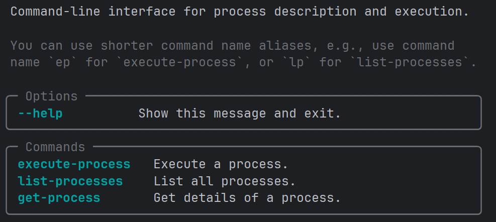
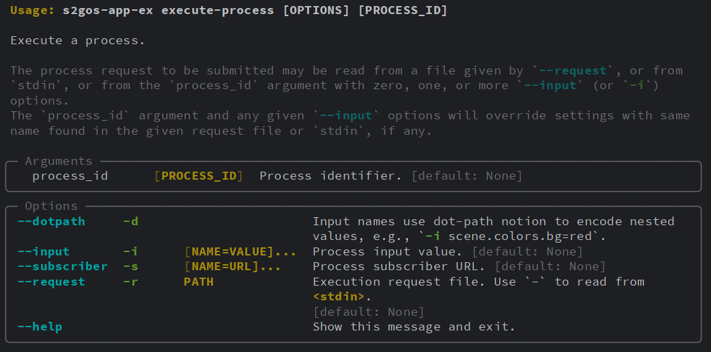

# Process Development

The Eozilla `procodile` package provides a simple Python framework that
allows for a couple of things:

- Registering your workflows comprising an entry-point (main) and
  steps implemented as Python functions.
- Querying and executing the workflow entry points via a dedicated Python API
  and CLI.
- Using YAML and JSON formats based on the interfaces and models
  defined by [OGC API - Processes](https://github.com/opengeospatial/ogcapi-processes).

Herewith it allows later application packaging by Eozilla _Appligator_.

Processor packages developed using the provided CLI can later on be used to
generate Docker images, Airflow DAGs, and optionally OGC Application Packages.

Currently, `procodile` comprises just a few handy top-level components:

* [class `ProcessRegistry`][procodile.ProcessRegistry] - to register your
  Python functions as processes in a central collection. Each process consists
  of **one or more Python functions** with explicitly defined dependencies.
  Internally, these functions are represented as **`Workflow`** objects and
  orchestrated according to their dependency graph.
  From the perspective of a Python API user, each workflow is represented as a
  `Process`, abstracting away the implementation details of a workflow and its
  step execution dependencies.
* [class `ExcecutionRequest`][gavicore.util.request.ExecutionRequest] - used to
  programmatically execute your processes from Python code, for example in
  a unit test or in a custom application.
* [class `JobContext`][procodile.JobContext] - used inside your process
  implementations to report progress or check for client-side cancellation.
* [function `new_cli()`][procodile.cli.new_cli] - creates a CLI for the
  processes in the registry.

## Development Recipe

Framework usage is simple, it is a 3-step process:

1. Populate process registry with process(es) derived from your Python functions.
2. Define a CLI instance from that process registry.
3. Define an entry point script for the CLI instance, so you can run your package
   as an application.

The steps are explained in more detail in the following.

### 1. Populate process registry

First, you'll create a process registry object of type `ProcessRegistry`.
For each process you plan to expose you implement a workflow
that comprises a single or multiple Python functions:

- To define a entry point to the process, write a Python function and decorate it 
  with `@registry.main`. This registers the function as an exposed, 
  executable process.
- This entry point supports both simple processes (using only `main`) 
  and multi-step workflows (using `main` with additional `steps`).
- To do this, add steps using the `@your_function.step` decorator, where 
  `your_function` is the function decorated with `@registry.main`.

Each step is registered as part of the workflow and enables more complex, 
  structured execution logic.

Please see  documentation to learn more
about it.

The `ctx` object of type [JobContext][procodile.JobContext]
can be used to report progress and to check for job cancellation.
You can get the job context inside the function body via `JobContext.get()`
or declare it as a function argument of type `JobContext`.

Process inputs, such as the arguments `path` or `factor` above,
can be further specified by
[`pydantic.Field`](https://docs.pydantic.dev/latest/concepts/fields/) annotations.
Field annotations for an argument can be provided via the `inputs` dictionary
passed to the [`main`][procodile.WorkflowRegsitry.main] or 
[`process`][procodile.WorkflowRegsitry.process] and [`step`][procodile.Workflow.step]
decorators,
or preferably as part of the type declaration using the Python `Annotated`
special form. An example for the latter is
`factor: Annotated[float, Field(title="Scaling factor", gt=0., le=10.)] = 1.0`.

Use `main` decorator to express a process that comprises multiple steps that 
require a reference to the main entry point.

Use `process` decorator to express a process that has no steps, hence requires 
no reference to a main step. 

This is purely for semantic reasons, in fact, the `process` decorator is an 
alias for `main` decorator.

Should your process have many arguments, you may consider defining them elsewhere
in a dedicated _pydantic Model_ derived from
[`pydantic.BaseModel`](https://docs.pydantic.dev/latest/concepts/models/), pass
it as single parameter to your function, and pass `inputs_arg=True` to the
`@process` decorator. Now the generated process description will report the class'
fields as inputs rather than the model class as single input. Conceptually:

```python
from typing import Annotated

from pydantic import BaseModel, Field
from procodile import JobContext, ProcessRegistry


class ArgsModel(BaseModel):
    # Required positional arguments
    arg1: Annotated[Type1, Field(..., **Specs1]
    arg2: Annotated[Type2, Field(..., **Specs2]
    # ...
    # Optional keyword arguments
    kwarg1: Annotated[Type1, Field(..., Specs1] = Default1
    kwarg2: Annotated[Type2, Field(..., Specs2] = Default2
    # ...

    registry = ProcessRegistry()

@registry.process(inputs_arg=True)
def my_func(args: ArgsModel) -> MyResult:
    ...
```


### 2. Define CLI instance

In a second step you define an instance of a common process CLI and pass it
a reference to your registry instance. In `my_app/cli.py`:

```python
from procodile.cli import new_cli

# The CLI with a basic set of commands.
# The `cli` is a Typer application of type `typer.Typer()`,
# so can use the instance to register your own commands.
cli = new_cli(registry="my_app.processes:registry", name="my-app", version="0.5.0")
```

You could also pass the imported registry directly, but using a
reference string defers importing the registry instance until it is
needed. This makes the CLI much faster if it is just called with
the `--help` option and hence no importing of yet unused libraries
takes place.

### 3. Define entry point script

In a last step you expose the CLI as an entry point script of your package.
In your `pyproject.toml`:

```toml
[project.scripts]
my-app = "my_app.cli:cli"
```

After installing `my_app` in a Python environment using `pip` or `pixi`
you can run your CLI as an executable and `my-app --help` will output:



## Usage Example

### Example project setup

An application example that can serve as a starting point is provided in the workspace
[procodile-example](https://github.com/eo-tools/eozilla/tree/main/procodile-example).
Please check out its `README.md` to install and run it.

The application's primary user interface is its simple, generated CLI
(you can extend it, if you like). For the above application example the CLI tool
is named `procodile-example`.

### Getting process information

Use `list-processes` (or short `lp`) subcommand to list the published processes, and use
`get-process` (or short `gp`) to get the details like the inputs of your your process.
The command `procodile-example gp primes_between` will give you the input specs of the
published process `primes_between`:

```json
{
  "title": "Prime Generator",
  "description": "Computes the list of prime numbers within an integer value range.",
  "id": "primes_between",
  "version": "0.0.0",
  "inputs": {
    "min_val": {
      "title": "Minimum value of search range",
      "minOccurs": 0,
      "schema": {
        "minimum": 0.0,
        "type": "integer",
        "default": 0
      }
    },
    "max_val": {
      "title": "Maximum value of search range",
      "minOccurs": 0,
      "schema": {
        "minimum": 0.0,
        "type": "integer",
        "default": 100
      }
    }
  },
  "outputs": {
    "return_value": {
      "title": "Return Value",
      "schema": {
        "type": "array",
        "items": {
          "type": "integer"
        }
      }
    }
  }
}
```

### Executing a process

To execute your processes, see help for the `execute-process` (or short `ep`)
subcommand:



### Execution request files

For larger or complex sets of input parameters it is recommended to use a
_execution request file_ in JSON or YAML format. The structure is simple, for example:

```json
{
    "process_id": "primes_between",
    "inputs": {
      "min_val": 100,
      "max_val": 200
    }
}
```

The process request file format in detail:

- `process_id`: Process identifier
- `dotpath`: Whether dots in input names should be used to create
  nested object values. Defaults to `False`.
- `inputs`: Optional process inputs given as key-value mapping.
  Values may be of any JSON-serializable type accepted by
  the given process.
- `outputs`: Optional process outputs given as key-value mapping.
  Values are of type [Output][gavicore.models.Output]
  and should be supported by the given process.
- `subscriber`: Optional object comprising callback
  URLs that are informed about process status changes
  while the processing takes place. The URLs are `successUri`,
  `inProgressUri`, and `failedUri` and none is required.
  See also [Subscriber][gavicore.models.Subscriber].

## Framework API

::: procodile.ProcessRegistry
options:
show_source: false
heading_level: 3

::: procodile.Process
options:
show_source: false
heading_level: 3

::: gavicore.models.ProcessRequest
options:
show_source: false
heading_level: 3

::: gavicore.models.Subscriber
options:
show_source: false
heading_level: 3

::: gavicore.models.Output
options:
show_source: false
heading_level: 3

::: gavicore.util.request.ExecutionRequest
options:
show_source: false
heading_level: 3

::: procodile.JobContext
options:
show_source: false
heading_level: 3

::: procodile.JobCancelledException
options:
show_source: false
heading_level: 3

::: procodile.cli.new_cli
options:
show_source: false
heading_level: 3
